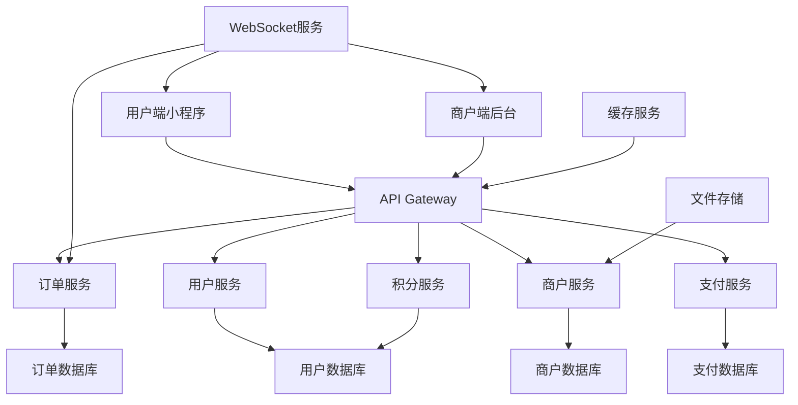

# Design Document

## Overview

本地生活服务小程序采用uni-app框架开发，支持微信小程序平台。应用采用Vue 3 + TypeScript + Composition API架构，实现商户预订和扫码点单的完整业务流程。

系统分为用户端小程序和商户端管理后台两个主要部分，通过RESTful API和WebSocket实现实时数据同步。

## Steering Document Alignment

### Technical Standards (tech.md)

由于项目尚未建立tech.md文档，设计将遵循以下技术标准：
- **代码规范**：采用Vue 3 Composition API + TypeScript严格模式
- **组件化原则**：单一职责、高内聚低耦合
- **API设计**：RESTful风格，统一错误处理和响应格式
- **状态管理**：采用Pinia进行状态管理

### Project Structure (structure.md)

项目结构将按功能模块组织：
- **pages层**：页面组件，对应业务功能
- **components层**：可复用UI组件
- **services层**：API服务和业务逻辑
- **stores层**：状态管理
- **utils层**：工具函数
- **types层**：TypeScript类型定义

## Code Reuse Analysis

### Existing Components to Leverage
- **uni-app基础组件**：利用uni-ui组件库提供的基础UI组件
- **微信小程序API**：扫码、支付、位置等原生能力
- **Vue 3 Composition API**：复用逻辑组合函数

### Integration Points
- **微信支付SDK**：集成微信小程序支付能力
- **WebSocket连接**：实现订单状态实时同步
- **本地存储**：用户信息、购物车数据缓存
- **图片/视频存储**：对接云存储服务

## Architecture

系统采用分层架构设计，前端采用MVVM模式，后端采用微服务架构。

### Modular Design Principles
- **Single File Responsibility**: 每个Vue文件专注单一页面或组件功能
- **Component Isolation**: UI组件、业务组件、页面组件分层隔离
- **Service Layer Separation**: API层、业务逻辑层、数据持久层分离
- **Utility Modularity**: 工具函数按功能域划分模块



## Components and Interfaces

### 用户端核心组件

#### CategorySelector (类目选择组件)
- **Purpose:** 展示商户类目，支持类目切换
- **Interfaces:** 
  - `onCategoryChange(categoryId: string): void`
  - `categories: Category[]`
- **Dependencies:** CategoryService
- **Reuses:** uni-ui的nav组件

#### StoreList (店铺列表组件)
- **Purpose:** 展示店铺列表，支持筛选和排序
- **Interfaces:**
  - `onStoreSelect(store: Store): void`
  - `stores: Store[]`
  - `filters: StoreFilter`
- **Dependencies:** StoreService, LocationService
- **Reuses:** uni-ui的list组件和card组件

#### SpaceViewer (空间预览组件)
- **Purpose:** 展示包间/卡座状态和视频预览
- **Interfaces:**
  - `onSpaceSelect(space: Space): void`
  - `spaces: Space[]`
  - `playVideo(videoUrl: string): void`
- **Dependencies:** MediaService
- **Reuses:** uni-ui的video组件

#### BookingForm (预订表单组件)
- **Purpose:** 处理预订信息输入和提交
- **Interfaces:**
  - `onBookingSubmit(booking: BookingData): void`
  - `userLevel: UserLevel`
  - `availablePoints: number`
- **Dependencies:** BookingService, PaymentService
- **Reuses:** uni-ui的form组件

#### QRCodeScanner (二维码扫描组件)
- **Purpose:** 扫码进入点单页面
- **Interfaces:**
  - `onScanSuccess(qrData: QRCodeData): void`
  - `onScanError(error: Error): void`
- **Dependencies:** uni.scanCode API
- **Reuses:** 微信小程序原生扫码能力

#### ProductCatalog (商品目录组件)
- **Purpose:** 展示商品分类和商品列表
- **Interfaces:**
  - `onProductSelect(product: Product): void`
  - `products: Product[]`
  - `categories: ProductCategory[]`
- **Dependencies:** ProductService
- **Reuses:** uni-ui的grid组件

#### ShoppingCart (购物车组件)
- **Purpose:** 管理购物车商品和数量
- **Interfaces:**
  - `onAddProduct(product: Product, quantity: number): void`
  - `onRemoveProduct(productId: string): void`
  - `onUpdateQuantity(productId: string, quantity: number): void`
  - `cartItems: CartItem[]`
- **Dependencies:** CartStore
- **Reuses:** uni-ui的stepper组件

### 服务层组件

#### APIService (API基础服务)
- **Purpose:** 统一API请求处理，包含认证、错误处理
- **Interfaces:**
  - `get<T>(url: string, params?: any): Promise<T>`
  - `post<T>(url: string, data?: any): Promise<T>`
  - `put<T>(url: string, data?: any): Promise<T>`
  - `delete<T>(url: string): Promise<T>`
- **Dependencies:** uni.request
- **Reuses:** uni-app网络请求API

#### UserService (用户服务)
- **Purpose:** 用户认证、等级管理、积分管理
- **Interfaces:**
  - `login(code: string): Promise<User>`
  - `getUserInfo(): Promise<User>`
  - `updateUserLevel(userId: string): Promise<UserLevel>`
  - `getPointsBalance(userId: string): Promise<number>`
- **Dependencies:** APIService
- **Reuses:** APIService基础请求能力

#### BookingService (预订服务)
- **Purpose:** 预订创建、状态管理、核销
- **Interfaces:**
  - `createBooking(booking: BookingData): Promise<Booking>`
  - `getBookingStatus(bookingId: string): Promise<BookingStatus>`
  - `verifyBooking(bookingCode: string): Promise<boolean>`
- **Dependencies:** APIService, PaymentService
- **Reuses:** APIService和支付服务

#### OrderService (订单服务)
- **Purpose:** 点单订单创建、状态跟踪
- **Interfaces:**
  - `createOrder(order: OrderData): Promise<Order>`
  - `trackOrderStatus(orderId: string): Promise<OrderStatus>`
  - `confirmDelivery(orderId: string): Promise<void>`
- **Dependencies:** APIService, WebSocketService
- **Reuses:** APIService和实时通讯服务

#### PaymentService (支付服务)
- **Purpose:** 微信支付集成、支付状态管理
- **Interfaces:**
  - `createPayment(amount: number, orderId: string): Promise<PaymentData>`
  - `verifyPayment(paymentId: string): Promise<PaymentStatus>`
- **Dependencies:** uni.requestPayment
- **Reuses:** 微信小程序支付API

#### WebSocketService (实时通讯服务)
- **Purpose:** 订单状态实时同步
- **Interfaces:**
  - `connect(token: string): void`
  - `disconnect(): void`
  - `onOrderStatusChange(callback: (status: OrderStatus) => void): void`
- **Dependencies:** uni.connectSocket
- **Reuses:** uni-app WebSocket API

## Data Models

### User (用户模型)
```typescript
interface User {
  id: string
  openId: string
  nickname: string
  avatar: string
  phone?: string
  level: UserLevel
  points: number
  createdAt: Date
  updatedAt: Date
}

enum UserLevel {
  NORMAL = 'normal',
  SILVER = 'silver', 
  GOLD = 'gold',
  DIAMOND = 'diamond',
  VIP = 'vip'
}
```

### Store (商户模型)
```typescript
interface Store {
  id: string
  name: string
  category: StoreCategory
  address: string
  location: Location
  businessHours: BusinessHours[]
  status: StoreStatus
  description: string
  images: string[]
  videoUrl?: string
  rating: number
  createdAt: Date
  updatedAt: Date
}

enum StoreCategory {
  KTV = 'ktv',
  TEA_HOUSE = 'tea_house',
  COFFEE_SHOP = 'coffee_shop'
}
```

### Space (空间模型)
```typescript
interface Space {
  id: string
  storeId: string
  name: string
  type: SpaceType
  capacity: {
    min: number
    max: number
  }
  facilities: string[]
  status: SpaceStatus
  videoUrl: string
  qrCode: string
  priceRules: PriceRule[]
  createdAt: Date
  updatedAt: Date
}

enum SpaceStatus {
  AVAILABLE = 'available',
  BOOKED = 'booked',
  OCCUPIED = 'occupied',
  MAINTENANCE = 'maintenance',
  CLEANING = 'cleaning'
}
```

### Booking (预订模型)
```typescript
interface Booking {
  id: string
  userId: string
  storeId: string
  spaceId: string
  status: BookingStatus
  bookingTime: Date
  peopleCount: number
  depositAmount: number
  pointsUsed: number
  paymentId?: string
  bookingCode: string
  createdAt: Date
  updatedAt: Date
}

enum BookingStatus {
  PENDING_PAYMENT = 'pending_payment',
  PAID = 'paid',
  CONFIRMED = 'confirmed',
  CHECKED_IN = 'checked_in',
  COMPLETED = 'completed',
  CANCELLED = 'cancelled'
}
```

### Product (商品模型)
```typescript
interface Product {
  id: string
  storeId: string
  name: string
  category: ProductCategory
  description: string
  images: string[]
  price: number
  memberPrice?: number
  specifications: ProductSpec[]
  stock: number
  status: ProductStatus
  preparationTime: number
  tags: string[]
  createdAt: Date
  updatedAt: Date
}

interface ProductSpec {
  name: string
  options: string[]
  required: boolean
}
```

### Order (订单模型)
```typescript
interface Order {
  id: string
  userId: string
  storeId: string
  spaceId: string
  items: OrderItem[]
  totalAmount: number
  discountAmount: number
  pointsUsed: number
  paymentAmount: number
  status: OrderStatus
  deliveryAddress: string
  specialInstructions?: string
  estimatedDeliveryTime: Date
  actualDeliveryTime?: Date
  paymentId?: string
  createdAt: Date
  updatedAt: Date
}

enum OrderStatus {
  PENDING_PAYMENT = 'pending_payment',
  PAID = 'paid',
  CONFIRMED = 'confirmed',
  PREPARING = 'preparing',
  DELIVERING = 'delivering',
  DELIVERED = 'delivered',
  COMPLETED = 'completed',
  CANCELLED = 'cancelled'
}
```

## Error Handling

### Error Scenarios

1. **网络请求失败**
   - **Handling:** 自动重试3次，显示友好错误提示
   - **User Impact:** 显示"网络异常，请检查网络连接"提示

2. **支付失败**
   - **Handling:** 记录失败原因，保持订单状态，提供重新支付选项
   - **User Impact:** 显示具体失败原因和重试按钮

3. **二维码扫描失败**
   - **Handling:** 检查权限，提供手动输入选项
   - **User Impact:** 显示权限申请提示或手动输入框

4. **库存不足**
   - **Handling:** 实时检查库存，自动移除缺货商品
   - **User Impact:** 显示商品缺货提示，建议替代商品

5. **订单状态同步异常**
   - **Handling:** 重连WebSocket，降级为轮询模式
   - **User Impact:** 数据可能延迟，但不影响基本功能

## Testing Strategy

### Unit Testing
- 使用Jest框架进行单元测试
- 重点测试工具函数、service层逻辑
- API响应数据格式验证
- 状态管理逻辑测试

### Integration Testing
- 测试页面组件与service层的集成
- 测试支付流程完整性
- 测试订单状态流转
- 测试WebSocket连接和消息处理

### End-to-End Testing
- 使用uni-automator进行E2E测试
- 测试完整的预订流程
- 测试完整的点单流程
- 测试用户等级升级流程
- 测试异常情况处理