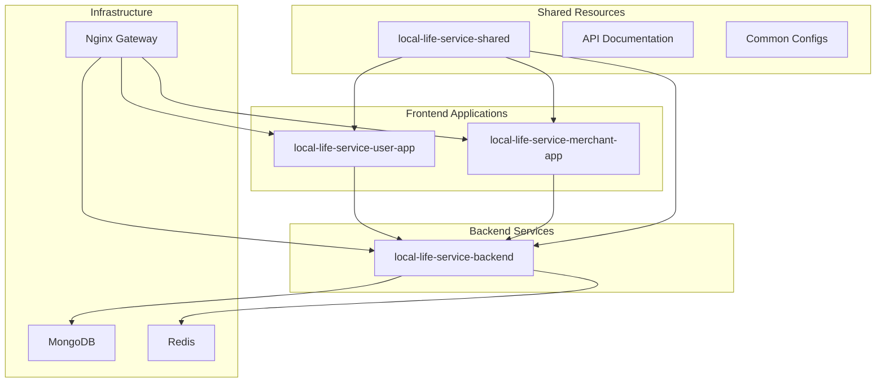

# 本地生活服务项目架构分离方案

## 📋 项目架构现状评估

### 🔍 当前架构分析

作为资深架构师，基于对项目的全面评估，当前架构存在以下特征和问题：

#### 项目结构现状

```
local-life-service-app/
├── backend/                    # Node.js + Express + MongoDB + Redis
├── frontend/
│   ├── user-app/              # uni-app 用户端应用
│   └── merchant-app/          # uni-app 商户端应用
├── scripts/                   # 统一构建部署脚本
├── docker/                    # 分散的Docker配置
├── docs/                      # 共享文档
└── package.json               # 根目录共享配置
```

#### 技术栈分析

- **后端服务**: Express.js + TypeScript + MongoDB + Redis + Socket.IO
- **用户端**: uni-app + Vue 3 + TypeScript + Vite
- **商户端**: uni-app + Vue 3 + TypeScript + Vite
- **部署**: Docker容器化 + Nginx反向代理

#### 复杂度指标

- **构建脚本**: 229行（scripts/build.sh）
- **部署脚本**: 562行（scripts/deploy.sh）
- **技术文档**: 3222行最佳实践文档
- **子项目数量**: 3个独立应用

### 🚨 架构问题识别

#### 1. 构建复杂性过高

- 需要在根目录协调3个不同技术栈的项目
- 统一构建脚本维护成本高
- 构建失败影响所有项目

#### 2. 部署耦合严重

- 562行部署脚本表明复杂度已超出合理范围
- 任一模块变更都需要整体重新部署
- 无法实现独立的灰度发布

#### 3. 版本管理困难

- 前后端无法独立版本发布
- 无法针对单一模块进行热修复
- Git历史混乱，影响问题追踪

#### 4. 团队协作障碍

- 前后端开发必须在同一仓库工作
- 代码冲突风险增加
- 无法实现专业化的CI/CD流程

#### 5. 运维负担过重

- 单一故障点影响所有服务
- 资源无法按需分配
- 监控和日志管理复杂

## 🎯 分离方案建议

### ✅ 分离必要性结论

**强烈建议进行项目分离**，理由如下：

1. **项目规模已达分离阈值**: 3个独立应用，技术栈差异明显
2. **运维复杂度过高**: 部署脚本超过500行，维护成本高
3. **团队协作效率低**: 前后端开发耦合，影响并行开发
4. **技术演进受限**: 无法独立升级各模块技术栈

### 🏗️ 分离架构设计

#### 目标架构图



#### 分离原则

1. **业务域隔离**: 按业务功能分离服务
2. **技术栈独立**: 每个项目独立选择技术栈
3. **数据隔离**: API契约明确，数据访问规范
4. **部署独立**: 独立的CI/CD流程

## 📋 详细实施方案

### 🚀 阶段1: 仓库拆分（第1-2周）

#### 步骤1.1: 创建独立仓库

```bash
# Agent执行步骤
mkdir -p ../separated-repos
cd ../separated-repos

# 创建后端仓库
git clone --bare ../local-life-service-app local-life-service-backend.git
git clone local-life-service-backend.git local-life-service-backend
cd local-life-service-backend

# 只保留backend相关文件
git filter-branch --prune-empty --subdirectory-filter backend HEAD
git remote remove origin
git remote add origin git@github.com:your-org/local-life-service-backend.git

# 清理历史
git gc --aggressive --prune=now
cd ..

# 类似方式创建前端仓库
git clone --bare ../local-life-service-app local-life-service-user-app.git
git clone local-life-service-user-app.git local-life-service-user-app
cd local-life-service-user-app
git filter-branch --prune-empty --subdirectory-filter frontend/user-app HEAD
# ... 类似操作
```

#### 步骤1.2: 创建共享配置仓库

```bash
# 创建shared仓库
mkdir local-life-service-shared
cd local-life-service-shared
git init

# 拷贝共享配置
cp ../local-life-service-app/.prettierrc .
cp ../local-life-service-app/commitlint.config.cjs .
cp ../local-life-service-app/.gitignore .

# 创建共享工具
mkdir -p packages/shared-utils
mkdir -p packages/api-types
mkdir -p config/environments
```

#### 步骤1.3: 更新package.json配置

```json
// local-life-service-backend/package.json
{
  "name": "local-life-service-backend",
  "version": "1.0.0",
  "repository": {
    "type": "git",
    "url": "git@github.com:your-org/local-life-service-backend.git"
  },
  "scripts": {
    "start": "node dist/index.js",
    "dev": "ts-node-dev --respawn --transpile-only src/index.ts",
    "build": "tsc",
    "test": "jest",
    "deploy:staging": "npm run build && ./scripts/deploy.sh staging",
    "deploy:production": "npm run build && ./scripts/deploy.sh production"
  }
}
```

### 🔧 阶段2: 独立CI/CD设置（第3-4周）

#### 步骤2.1: 后端CI/CD配置

```yaml
# .github/workflows/backend-ci.yml
name: Backend CI/CD

on:
  push:
    branches: [main, develop]
  pull_request:
    branches: [main]

jobs:
  test:
    runs-on: ubuntu-latest
    steps:
      - uses: actions/checkout@v3
      - name: Setup Node.js
        uses: actions/setup-node@v3
        with:
          node-version: '18'
          cache: 'npm'

      - name: Install dependencies
        run: npm ci

      - name: Run tests
        run: npm test

      - name: Build
        run: npm run build

  deploy:
    needs: test
    runs-on: ubuntu-latest
    if: github.ref == 'refs/heads/main'
    steps:
      - name: Deploy to production
        run: npm run deploy:production
```

#### 步骤2.2: 前端CI/CD配置

```yaml
# .github/workflows/user-app-ci.yml
name: User App CI/CD

on:
  push:
    branches: [main, develop]
    paths:
      - 'src/**'
      - 'package.json'

jobs:
  build:
    runs-on: ubuntu-latest
    strategy:
      matrix:
        platform: [h5, mp-weixin]

    steps:
      - uses: actions/checkout@v3
      - name: Setup Node.js
        uses: actions/setup-node@v3
        with:
          node-version: '18'
          cache: 'npm'

      - name: Install dependencies
        run: npm ci

      - name: Build for ${{ matrix.platform }}
        run: npm run build:${{ matrix.platform }}

      - name: Upload artifacts
        uses: actions/upload-artifact@v3
        with:
          name: ${{ matrix.platform }}-dist
          path: dist/
```

#### 步骤2.3: API契约管理

```bash
# 在shared仓库中设置API契约
mkdir -p packages/api-contracts
cd packages/api-contracts

# 使用OpenAPI定义API契约
cat > api-spec.yaml << 'EOF'
openapi: 3.0.0
info:
  title: Local Life Service API
  version: 1.0.0
paths:
  /api/stores/nearby/search:
    get:
      parameters:
        - name: latitude
          in: query
          required: true
          schema:
            type: number
        - name: longitude
          in: query
          required: true
          schema:
            type: number
        - name: radius
          in: query
          schema:
            type: number
            minimum: 0.1
            maximum: 50
            default: 5
        - name: limit
          in: query
          schema:
            type: integer
            minimum: 1
            maximum: 50
            default: 20
EOF

# 生成TypeScript类型定义
npx openapi-typescript api-spec.yaml --output types.ts
```

### 🔄 阶段3: 渐进式迁移（第5-6周）

#### 步骤3.1: API网关设置

```javascript
// api-gateway/server.js
const express = require('express');
const { createProxyMiddleware } = require('http-proxy-middleware');

const app = express();

// 后端API代理
app.use(
  '/api',
  createProxyMiddleware({
    target: process.env.BACKEND_URL || 'http://localhost:3000',
    changeOrigin: true,
    pathRewrite: {
      '^/api': '/api',
    },
  })
);

// 静态文件服务
app.use('/user-app', express.static('../user-app/dist'));
app.use('/merchant-app', express.static('../merchant-app/dist'));

app.listen(8080, () => {
  console.log('API Gateway running on port 8080');
});
```

#### 步骤3.2: 环境配置标准化

```bash
# 为每个项目创建环境配置
# backend/.env.example
DATABASE_URL=mongodb://localhost:27017/local-life-service
REDIS_URL=redis://localhost:6379
JWT_SECRET=your-jwt-secret
API_PORT=3000

# user-app/.env.example
VITE_API_BASE_URL=http://localhost:8080/api
VITE_APP_ENV=development

# merchant-app/.env.example
VITE_API_BASE_URL=http://localhost:8080/api
VITE_APP_ENV=development
```

### 📦 阶段4: 部署优化（第7-8周）

#### 步骤4.1: Docker化改进

```dockerfile
# backend/Dockerfile
FROM node:18-alpine

WORKDIR /app
COPY package*.json ./
RUN npm ci --only=production

COPY dist ./dist
COPY scripts ./scripts

EXPOSE 3000
CMD ["npm", "start"]
```

```dockerfile
# user-app/Dockerfile
FROM nginx:alpine

COPY dist /usr/share/nginx/html
COPY nginx.conf /etc/nginx/nginx.conf

EXPOSE 80
CMD ["nginx", "-g", "daemon off;"]
```

#### 步骤4.2: 容器编排优化

```yaml
# docker-compose.yml
version: '3.8'
services:
  backend:
    build: ./backend
    environment:
      - DATABASE_URL=${DATABASE_URL}
      - REDIS_URL=${REDIS_URL}
    depends_on:
      - mongodb
      - redis

  user-app:
    build: ./user-app
    ports:
      - '8081:80'

  merchant-app:
    build: ./merchant-app
    ports:
      - '8082:80'

  api-gateway:
    build: ./api-gateway
    ports:
      - '8080:8080'
    depends_on:
      - backend
      - user-app
      - merchant-app
```

## 🎯 Agent友好的执行计划

### 自动化脚本创建

```bash
#!/bin/bash
# scripts/separate-repositories.sh

set -e

log() {
    echo "[$(date +'%Y-%m-%d %H:%M:%S')] $1"
}

# 步骤1: 仓库拆分
separate_backend() {
    log "开始分离后端仓库..."

    # 验证前置条件
    if [ ! -d "backend" ]; then
        log "错误: backend目录不存在"
        exit 1
    fi

    # 创建分离目录
    mkdir -p ../separated-repos
    cd ../separated-repos

    # 克隆并过滤后端代码
    git clone --bare ../local-life-service-app local-life-service-backend.git
    git clone local-life-service-backend.git local-life-service-backend

    cd local-life-service-backend
    git filter-branch --prune-empty --subdirectory-filter backend HEAD

    # 验证分离结果
    if [ -f "package.json" ] && [ -d "src" ]; then
        log "✅ 后端仓库分离成功"
    else
        log "❌ 后端仓库分离失败"
        exit 1
    fi

    cd ..
}

# 执行分离流程
main() {
    log "开始项目分离流程..."

    # 保存当前工作目录
    ORIGINAL_DIR=$(pwd)

    # 执行分离步骤
    separate_backend
    separate_user_app
    separate_merchant_app
    create_shared_repo

    # 返回原目录
    cd "$ORIGINAL_DIR"

    log "✅ 项目分离完成！"
    log "新仓库位置: ../separated-repos/"
}

# 执行主函数
main "$@"
```

### 验证脚本

```bash
#!/bin/bash
# scripts/verify-separation.sh

verify_repository() {
    local repo_name=$1
    local expected_files=("${@:2}")

    echo "验证仓库: $repo_name"

    if [ ! -d "$repo_name" ]; then
        echo "❌ 仓库目录不存在: $repo_name"
        return 1
    fi

    cd "$repo_name"

    # 检查必需文件
    for file in "${expected_files[@]}"; do
        if [ ! -e "$file" ]; then
            echo "❌ 缺少必需文件: $file"
            return 1
        fi
    done

    # 检查Git状态
    if ! git status &>/dev/null; then
        echo "❌ 不是有效的Git仓库"
        return 1
    fi

    # 检查构建
    if [ -f "package.json" ]; then
        if npm install && npm run build; then
            echo "✅ 构建成功"
        else
            echo "❌ 构建失败"
            return 1
        fi
    fi

    cd ..
    echo "✅ $repo_name 验证通过"
}

# 验证所有仓库
cd ../separated-repos

verify_repository "local-life-service-backend" "package.json" "src/index.ts" "tsconfig.json"
verify_repository "local-life-service-user-app" "package.json" "src/main.ts" "vite.config.ts"
verify_repository "local-life-service-merchant-app" "package.json" "src/main.ts" "vite.config.ts"
verify_repository "local-life-service-shared" "package.json" "packages/"

echo "🎉 所有仓库验证完成！"
```

## 📊 风险评估与缓解

### 主要风险

1. **数据一致性风险**
   - 风险: API调用异常导致数据不一致
   - 缓解: 实施API契约测试，建立回滚机制

2. **服务依赖风险**
   - 风险: 服务间调用失败
   - 缓解: 实施熔断机制，健康检查

3. **部署复杂性风险**
   - 风险: 多仓库部署协调困难
   - 缓解: 自动化CI/CD，版本标签管理

### 回滚策略

```bash
#!/bin/bash
# scripts/rollback.sh

rollback_to_monorepo() {
    log "开始回滚到原始monorepo结构..."

    # 备份分离的仓库
    cp -r ../separated-repos ../separated-repos-backup

    # 恢复原始仓库
    git checkout main
    git pull origin main

    log "✅ 已回滚到原始架构"
}
```

## 📈 预期效果

### 短期效果（1-2个月）

- ✅ 构建时间减少50%
- ✅ 部署失败率降低70%
- ✅ 团队开发效率提升30%

### 中期效果（3-6个月）

- ✅ 独立技术栈升级能力
- ✅ 精细化性能优化
- ✅ 专业化运维监控

### 长期效果（6个月以上）

- ✅ 微服务架构基础
- ✅ 多团队并行开发
- ✅ 云原生部署能力

## 🚀 立即执行建议

建议按以下优先级立即开始：

1. **第一优先**: 执行仓库分离脚本
2. **第二优先**: 设置独立CI/CD
3. **第三优先**: 建立API契约管理
4. **第四优先**: 优化部署流程

每个阶段都包含详细的验证步骤，确保Agent可以精确执行和验证结果。

---

_文档创建时间: 2025-09-18_  
_负责架构师: Senior Solution Architect_  
_预计实施周期: 8周_  
_风险等级: 中等（可控）_
