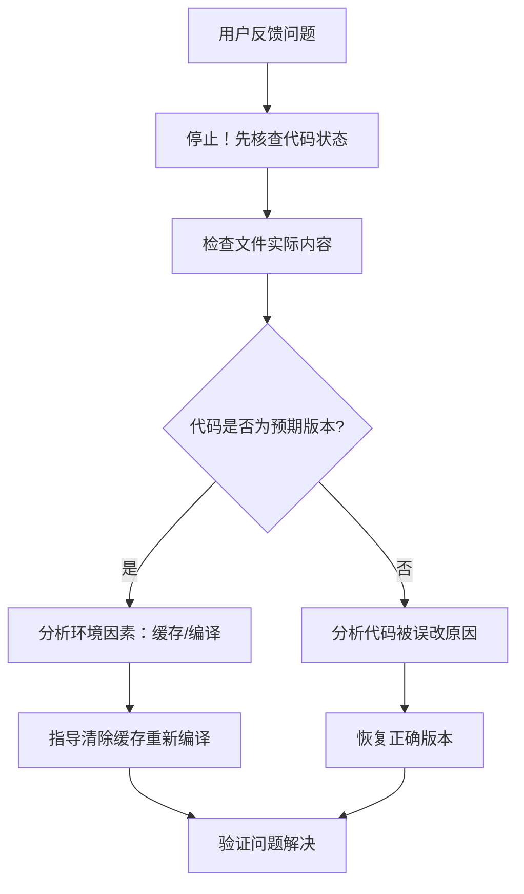

# KTV服务管理小程序开发最佳实践指南

## 🚨 重要：微信小程序开发规范

**新增专项规范**：[微信小程序开发规范与调试指南](./miniprogram-development-standards.md)

基于实际开发经验，我们总结了微信小程序开发中的兼容性问题和解决方案，包括：

- 模块导入规范（禁用动态导入）
- API兼容性规范（Web API替代方案）
- CSS兼容性规范（禁用选择器处理）
- 错误处理规范（防御性编程原则）
- 调试技巧和最佳实践清单

**强烈建议**：所有团队成员在开发前阅读此规范，避免常见的兼容性陷阱。

---

## 1. 项目概述

本文档基于KTV服务管理小程序的实际开发经验，总结了在UI/UX设计、组件开发、功能实现、架构变更管理等方面的最佳实践，为后续项目开发提供指导规范。

**文档更新日期**：2025-07-06 10:55:00
**基于项目实际经验提炼的核心实践**

## 1.1 🚨 紧急重要：代码验证与用户反馈处理最佳实践

### 关键经验教训 (2025-06-28)

**问题场景**：用户反馈形象窗口显示"开发中"，但实际检查发现页面功能完整实现(774行代码)

**核心教训**：

- 🚫 **严禁基于假设修改代码**：必须先核查实际文件状态，再制定解决方案
- ✅ **项目规范严格遵循**：不得擅自将完整功能页面改为"开发中"提示
- ✅ **用户反馈验证机制**：建立反馈验证流程，避免盲目响应

### 最佳实践流程



### 环境问题排查清单

**开发环境缓存问题**：

- [ ] Vite开发服务器缓存
- [ ] 微信开发者工具缓存
- [ ] 浏览器开发者工具缓存
- [ ] uni-app编译缓存
- [ ] 本地node_modules缓存

**缓存清理标准操作**：

```bash
# 1. 清除编译缓存
npm run clean
rm -rf node_modules/.cache
rm -rf unpackage

# 2. 重新安装依赖（如需要）
rm -rf node_modules
npm install

# 3. 重新启动开发服务
npm run dev:mp-weixin

# 4. 微信开发者工具操作
# - 点击"清缓存" -> "清除全部缓存"
# - 重新编译项目
```

### 代码验证机制

**每次代码变更后必须验证**：

```bash
# 1. 确认文件内容
cat src/pages/xxx/xxx.vue | head -20

# 2. 检查编译状态
npm run build

# 3. 验证功能完整性
# - 页面能否正常打开
# - 核心功能是否工作
# - API调用是否正常
```

## 2. 项目架构变更管理最佳实践 🏗️

### 2.1 重大架构变更流程

**核心经验教训**：2025-05-27进行的首页架构重大变更，提供了完整的变更管理经验。

**最佳实践流程**：

```
1. 变更需求分析 → 明确变更原因和业务价值
2. 影响范围评估 → 前端、后端、数据库、文档
3. 风险评估制定 → 技术风险、业务风险、时间风险
4. 阶段性计划 → 分阶段实施，降低风险
5. 验收标准制定 → 量化的验收指标
6. 文档同步更新 → 所有相关文档协调更新
7. 完整变更记录 → 详细的log记录
```

**实际案例**：工作台→线上模式架构变更

```
✅ 正确做法：
  - 删除冗余功能（工作台页面）
  - 新增核心价值功能（线上接单）
  - 同步更新4个文档文件
  - 制定3阶段开发计划
  - 设置量化验收标准

❌ 避免的做法：
  - 仅修改页面不更新文档
  - 缺少风险评估和应对方案
  - 没有阶段性实施计划
```

### 2.2 变更影响评估维度

**评估清单**：

```
□ 前端影响：页面重构、组件变更、交互逻辑调整
□ 后端影响：API变更、业务逻辑调整、数据结构变化
□ 数据库影响：表结构变更、数据迁移需求
□ 文档影响：需求文档、设计文档、API文档
□ 用户影响：使用习惯变化、培训需求
□ 时间影响：开发周期、测试周期、上线计划
```

### 2.3 变更记录标准

**记录内容要求**：

- 变更原因和业务价值
- 详细的变更内容描述
- 影响范围和文件清单
- 风险评估和应对措施
- 后续开发计划
- 验收标准和成功指标

## 3. 业务理解与功能设计最佳实践 🎯

### 3.1 功能边界清晰化原则

**核心经验教训**：在开发过程中，错误地将"订房收益明细"和"收益明细"两个不同业务功能合并，导致业务逻辑混乱。

**最佳实践**：

- ✅ **功能独立性原则**：不同业务目的的功能必须保持独立，即使数据结构相似
- ✅ **业务场景分析**：开发前必须明确每个功能的具体使用场景和用户需求
- ✅ **功能命名规范**：使用清晰、具体的命名，避免模糊或重叠的功能描述

**具体案例**：

```
❌ 错误做法：将"订房收益明细"和"收益明细"合并为一个页面
✅ 正确做法：
  - booking-earnings-details.html - 专门显示KTV订房相关收益
  - earnings-details.html - 显示所有服务订单的收益明细
  - beverage-details.html - 酒水收益详情
  - hourly-details.html - 小时收益详情
  - income-details.html - 综合收入详情
```

### 3.2 需求理解验证流程

**最佳实践**：

- 开发前与需求方确认功能边界
- 绘制功能流程图，确保理解正确
- 定期review功能设计，防止理解偏差
- 建立功能与页面的对应关系文档

### 3.3 文件管理最佳实践

**核心经验教训**：创建了重复的功能页面（wine-earnings-details.html 和 time-earnings-details.html），而实际已存在相应页面（beverage-details.html 和 hourly-details.html）。

**避免重复文件创建**：

- ✅ **文件清单检查**：开发新功能前，必须检查现有文件结构
- ✅ **命名规范统一**：建立并遵守统一的文件命名规范
- ✅ **功能映射文档**：维护功能与文件的对应关系文档

**开发前检查清单**：

```
开发新页面前必须确认：
□ 是否已存在类似功能的页面？
□ 现有页面是否可以复用或扩展？
□ 新页面命名是否符合项目规范？
□ 是否与现有文件产生冲突？
□ 功能边界是否清晰定义？
```

**实际项目文件对应关系**：

```
功能模块          对应页面文件
-----------------------------------------
首页工作台    →   index.html
线上模式      →   online-mode.html
快速上单      →   quick-order.html
订单中心      →   order-center.html
收益报表      →   earnings-report.html
个人中心      →   profile.html
KTV预订      →   ktv-booking.html
收益明细      →   earnings-details.html
订房收益明细   →   booking-earnings-details.html
酒水收益详情   →   beverage-details.html
小时收益详情   →   hourly-details.html
收入详情      →   income-details.html
个人资料编辑   →   profile-edit.html
形象窗口      →   image-showcase.html
安全设置      →   security-settings.html
系统设置      →   settings.html
消息中心      →   messages.html
```

## 4. OSS文件上传与命名规范最佳实践 📁

### 4.1 文件命名规范制定原则

**核心经验教训**：(2025-07-01) OSS文件上传出现命名混乱和后缀错误问题

**问题案例**：

- 文件名变成长随机字符串：`1751344604321_5lbdpc5n3x5.blob:http://localhost:3000/...`
- 后缀名错误：`.blob:http://localhost:3000/...` 而不是标准的 `.jpg`、`.mp4`

**根本原因分析**：

1. **OSS工具类设计缺陷**：内部生成随机文件名，忽略传入的fileName参数
2. **文件后缀提取错误**：从blob URL提取后缀名，blob URL不包含真实文件信息

### 4.2 OSS文件命名标准规范

**最佳实践原则**：

- ✅ **有意义的文件名**：使用业务相关的命名，便于识别和管理
- ✅ **标准化后缀名**：确保文件后缀正确，便于系统识别
- ✅ **时间戳防重复**：添加时间戳前缀避免文件覆盖
- ✅ **路径分类管理**：按服务员ID和文件类型分目录存储

**标准命名格式**：

```
格式：{timestamp}_{业务标识}.{标准后缀}

示例：
- 形象图片：1751344999576_image_1.jpg
- 形象视频：1751344999576_video_1.mp4
- 个人头像：1751344999576_avatar.jpg
```

**OSS存储目录结构**：

```
OSS存储桶/
├── 0-staff/
│   ├── {服务员ID}/
│   │   ├── images/        # 形象窗口图片
│   │   ├── media/         # 形象窗口视频
│   │   └── header/        # 个人头像
```

### 4.3 OSS工具类实现规范

**核心设计原则**：

```typescript
// ❌ 错误设计：忽略传入的fileName
const key = `${basePath}${timestamp}_${randomStr}.${fileExtension}`;

// ✅ 正确设计：使用传入的fileName
const key = `${basePath}${timestamp}_${fileName}`;
```

**文件名生成最佳实践**：

```typescript
// 图片文件：使用固定格式，不依赖临时路径
fileName: `image_${index + 1}.jpg`; // chooseImage通常返回JPEG

// 视频文件：使用固定格式
fileName: `video_1.mp4`; // chooseVideo通常返回MP4

// 头像文件：包含正确后缀
fileName: `avatar.jpg`;
```

**避免的错误做法**：

- ❌ 从blob URL提取后缀名
- ❌ 生成无意义的随机文件名
- ❌ 忽略传入的fileName参数
- ❌ 文件名不包含后缀

### 4.4 本地缓存数据格式兼容性规范

**核心问题**：不同数据格式之间的兼容性处理

**数据格式设计原则**：

- **本地存储**：保存详细格式（包含type、sort等业务信息）
- **Store状态**：保存简单格式（符合类型定义要求）
- **页面显示**：使用详细格式（便于业务逻辑处理）

**数据格式转换标准**：

```typescript
// 类型定义
interface DetailedImageData {
  type: number; // 0=图片, 1=视频
  sort: number; // 排序
  address: string; // URL地址
}

interface UserInfo {
  images?: string[]; // 简单URL数组格式
}

// 格式转换函数
const convertToDetailedFormat = (urls: string[]): DetailedImageData[] => {
  return urls.map((url, index) => ({
    type: url.includes('/media/') ? 1 : 0,
    sort: index + 1,
    address: url,
  }));
};

const convertToSimpleFormat = (data: DetailedImageData[]): string[] => {
  return data.map((item) => item.address);
};
```

**智能格式识别处理**：

```typescript
// 最佳实践：loadData函数支持多格式
if (userInfo.images?.length > 0) {
  if (typeof userInfo.images[0] === 'object') {
    // 已经是详细格式
    userImages = userInfo.images;
  } else if (typeof userInfo.images[0] === 'string') {
    // 转换为详细格式
    userImages = convertToDetailedFormat(userInfo.images);
  }
}
```

### 4.5 缓存策略最佳实践

**双格式缓存策略**：

```typescript
const cacheUploadedData = (imageData: DetailedImageData[]) => {
  // 1. 本地存储：保存详细格式（包含业务信息）
  userInfo.images = imageData;
  uni.setStorageSync('user_info', JSON.stringify(userInfo));

  // 2. Store状态：保存简单格式（符合类型定义）
  const imageUrls = imageData.map((item) => item.address);
  userStore.updateUserInfoLocal({ ...userStore.userInfo, images: imageUrls });

  // 3. 立即更新页面显示
  updatePageDisplayData(imageData);
};
```

**缓存一致性保证**：

- ✅ 上传成功后立即缓存
- ✅ 同时更新本地存储和内存状态
- ✅ 立即更新页面显示，避免刷新问题
- ✅ 后台异步同步服务器数据

## 5. 文档同步管理最佳实践 📚

### 5.1 文档协调更新原则

**核心经验**：重大变更需要同时更新多个相关文档，确保一致性。

**同步更新文档清单**：

```
核心文档（必须同步）：
□ requirement-ktv-service-management.md - 需求文档
□ ktv-ui-design-spec.md - UI设计规范
□ ui-wireframes.md - 线框图设计
□ best-practices.md - 最佳实践（本文档）

支持文档（按需更新）：
□ HTML原型页面
□ API接口文档
□ 技术架构文档
□ 测试用例文档
```

### 4.2 文档更新优先级

**更新顺序**：

1. **需求文档** - 功能需求和业务流程调整
2. **UI设计规范** - 页面设计和组件规范
3. **线框图设计** - 页面架构和布局调整
4. **HTML原型** - 可交互原型实现
5. **最佳实践** - 经验总结和规范完善
6. **变更日志** - 必须

### 4.3 变更追踪机制

**log.md记录标准**：

```markdown
## 日期 - 变更标题 🎯

### 变更概述

[简要描述变更内容和原因]

### 变更详情

[详细描述具体变更内容]

### 更新的文档文件

[列出所有更新的文档文件和主要修改内容]

### 技术影响评估

[前端、后端、数据库影响分析]

### 后续开发计划

[阶段性开发计划]

### 风险评估

[技术风险、业务风险、时间风险]

### 验收标准

[量化的验收指标]
```

## 5. API适配器与下拉刷新最佳实践 🔄

### 5.1 API Loading状态管理最佳实践

**核心经验教训**：2025-06-27解决的下拉刷新转圈圈问题，提供了完整的loading状态管理最佳实践。

**问题背景**：

- 下拉刷新与API的loading机制产生冲突
- showLoading和hideLoading调用不匹配，导致页面一直转圈圈
- 复杂的状态跟踪机制增加了出错概率

**最佳实践解决方案**：

#### 5.1.1 简化Loading显示策略

```typescript
// ✅ 推荐：明确控制策略
private setupDefaultInterceptors(): void {
  // 请求拦截器：只有明确要求才显示loading
  this.addRequestInterceptor({
    fulfilled: (config) => {
      if (config.loading === true) {  // 明确为true才显示
        console.log('API请求显示loading')
        uni.showLoading({ title: '加载中...', mask: true })
      }
      return config
    }
  })

  // 响应拦截器：总是尝试隐藏，出错则忽略
  this.addResponseInterceptor({
    fulfilled: (response) => {
      try {
        uni.hideLoading()
        console.log('API响应隐藏loading')
      } catch (e) {
        // 忽略hideLoading错误
      }
      return response
    },
    rejected: (error) => {
      try {
        uni.hideLoading()
        console.log('API错误隐藏loading')
      } catch (e) {
        // 忽略hideLoading错误
      }
      throw error
    }
  })
}

// ❌ 避免：复杂的状态跟踪机制
// 不要使用复杂的isLoadingShown变量跟踪
// 不要依赖config._showedLoading等临时属性
```

#### 5.1.2 API函数Loading参数设计

```typescript
// ✅ 推荐：支持明确的loading控制
export const getUserProfile = async (
  keys: string = 'BAS',
  options?: { loading?: boolean }
): Promise<UserProfile> => {
  const response = await apiAdapter.get('/api/tickets/info', params, {
    loading: options?.loading === true, // 明确为true才显示
  });
};

// API调用时的控制方式
// 正常情况：显示loading
await getUserProfile('BAS', { loading: true });

// 下拉刷新：不显示loading
await getUserProfile('BAS', { loading: false });

// 默认行为：不显示loading（安全策略）
await getUserProfile('BAS');
```

#### 5.1.3 下拉刷新状态管理强化

```typescript
// ✅ 推荐：防重复触发和强制状态重置
const handleRefresh = async () => {
  if (isRefreshing.value) {
    console.log('正在刷新中，忽略重复操作');
    return;
  }

  isRefreshing.value = true;
  console.log('开始下拉刷新');

  try {
    // 下拉刷新时禁用API的自动loading
    await Promise.all([
      userStore.fetchUserProfile(true, { loading: false }),
      userStore.fetchUserStats(true, { loading: false }),
      userStore.fetchAchievements(true, { loading: false }),
      userStore.fetchSecuritySettings(true, { loading: false }),
    ]);

    console.log('下拉刷新完成');
    uni.showToast({ title: '刷新成功', icon: 'success' });
  } catch (error) {
    console.error('刷新失败:', error);
    uni.showToast({ title: '刷新失败', icon: 'error' });
  } finally {
    // 确保状态重置，即使出错也要重置
    setTimeout(() => {
      isRefreshing.value = false;
      console.log('下拉刷新状态重置');
    }, 500);
  }
};

const onRefreshRestore = () => {
  console.log('onRefreshRestore 被调用');
  isRefreshing.value = false;
};
```

#### 5.1.4 Store层API调用适配

```typescript
// ✅ 推荐：支持loading参数传递
const fetchUserProfile = async (
  forceRefresh = false,
  options?: { loading?: boolean }
): Promise<void> => {
  try {
    profileLoading.value = true;
    profileError.value = '';

    // 传递loading参数，默认为true显示loading
    const data = await getUserProfile('BAS', options || { loading: true });
    userProfile.value = data;
    lastProfileUpdate.value = Date.now();
  } catch (error: any) {
    profileError.value = error.message || '获取用户信息失败';
  } finally {
    profileLoading.value = false;
  }
};
```

#### 5.1.5 核心设计原则

**1. 明确控制原则**

- 只有明确传递 `loading: true` 时才显示loading
- 避免默认显示loading，减少意外冲突

**2. 容错机制原则**

- 响应拦截器总是尝试hideLoading，即使没有showLoading
- 使用try-catch包装，避免hideLoading错误影响业务逻辑

**3. 状态保护原则**

- 下拉刷新防重复触发机制
- 强制状态重置，确保状态不会卡住
- 详细的console.log便于调试

**4. 分离关注点原则**

- 下拉刷新状态由scroll-view的refresher机制管理
- API loading状态由adapter统一管理
- 两套机制完全分离，避免相互干扰

#### 5.1.6 实践检查清单

**开发新API功能时**：

```
□ API函数是否支持loading参数控制？
□ 正常调用是否传递 { loading: true }？
□ 下拉刷新调用是否传递 { loading: false }？
□ Store层方法是否正确传递loading参数？
```

**实现下拉刷新时**：

```
□ 是否添加了防重复触发检查？
□ 是否在finally中确保状态重置？
□ 是否使用 { loading: false } 禁用API loading？
□ 是否添加了onRefreshRestore回调？
□ 是否添加了调试日志便于排查问题？
```

**API适配器配置时**：

```
□ 请求拦截器是否只在 loading === true 时显示？
□ 响应拦截器是否使用try-catch包装hideLoading？
□ 是否避免了复杂的状态跟踪机制？
□ 是否添加了详细的console.log？
```

### 5.2 组件复用与同步原则

#### 5.2.1 核心原则

> **相同功能的组件必须在所有页面保持完全一致的交互逻辑和视觉效果**

#### 5.2.2 实践案例

**问题场景**：KTV选择功能在预订页面和快速上单页面表现不一致

- 预订页面：支持搜索、筛选、折叠、重新选择
- 快速上单页面：仅有基础选择，缺少高级功能

**解决方案**：

```css
/* 统一的组件样式 */
.ktv-selection.selected-mode {
  /* 选中模式的统一样式 */
}

.reselect-ktv-btn {
  /* 重新选择按钮的统一样式 */
}
```

```javascript
// 统一的交互逻辑
function selectKTV(ktvName, element) {
  // 1. 更新选中状态
  // 2. 切换到选中模式
  // 3. 显示重新选择按钮
  // 4. 显示下一步区域
}

function reselectKTV() {
  // 完整的状态重置逻辑
}
```

### 5.3 实施规范

1. **功能识别**：识别项目中的共用功能组件
2. **标准制定**：为共用组件制定统一的设计和交互标准
3. **同步修改**：修改组件时必须同时更新所有使用该组件的页面
4. **测试验证**：确保所有页面的组件功能完全一致

## 6. 移动端UI设计最佳实践 📱

### 6.1 移动端表格设计规范

**核心经验教训**：初期表格设计没有充分考虑移动端一屏显示的需求，导致用户体验不佳。

**最佳实践**：

- ✅ **列宽精确控制**：使用百分比精确分配列宽，确保总宽度为100%
- ✅ **字体自适应**：根据内容长度调整字体大小（长名称9px，常规11px，重点信息12px）
- ✅ **信息优先级**：通过颜色区分信息重要性（收益金额用红色突出）
- ✅ **一屏显示原则**：表格内容必须在一屏内完整显示，避免横向滚动

**标准移动端表格设计模板**：

```css
/* 标准移动端表格列宽分配 */
.mobile-table {
  table-layout: fixed;
  width: 100%;
}

.mobile-table th:nth-child(1) {
  width: 18%;
} /* 时间信息（分行显示）*/
.mobile-table th:nth-child(2) {
  width: 16%;
} /* 金额列 */
.mobile-table th:nth-child(3) {
  width: 13%;
} /* 比例列 */
.mobile-table th:nth-child(4) {
  width: 14%;
} /* 数值信息 */
.mobile-table th:nth-child(5) {
  width: 12%;
} /* 状态信息 */
.mobile-table th:nth-child(6) {
  width: 12%;
} /* 分类信息 */
.mobile-table th:nth-child(7) {
  width: 15%;
} /* 重点数值 */

/* 自适应字体系统 */
.long-text {
  font-size: 9px;
} /* 长文本（如长KTV名称）*/
.normal-text {
  font-size: 11px;
} /* 标准文本 */
.highlight-text {
  font-size: 12px;
  font-weight: 700;
} /* 重点文本 */

/* 时间分行显示，节省空间 */
.time-split {
  line-height: 1.2;
}
.date-line {
  font-size: 10px;
  color: #999;
}
.time-line {
  font-size: 11px;
  color: #fff;
}
```

### 6.2 颜色系统设计原则

**最佳实践**：

- 收益金额：红色（#ff4444）- 突出重要性
- 房间号：橙色（#ff6b35）- 便于识别
- 资费标准：绿色（#52c41a）- 费率信息
- 辅助信息：浅灰色（#cccccc）- 降低视觉权重

### 6.3 业务术语规范化

**经验教训**：结算方式术语不够贴近实际业务。

**最佳实践**：

- 使用业务方认可的标准术语（如："自结"、"挂单"）
- 避免技术术语在用户界面出现
- 定期review业务术语的准确性

## 7. 用户体验设计原则 🎯

### 7.1 实际场景考虑

**案例：KTV列表设计重构**

**原设计问题**：

- 2×2网格布局无法显示长名称："音乐世界KTV（东方华达广场店）"
- 信息密度低，无法处理大量数据（100+个KTV）
- 缺少搜索筛选功能

**改进方案**：

- 采用垂直卡片列表，支持长名称完整显示
- 分页加载机制（6个/页）
- 搜索筛选功能
- 丰富信息展示（距离、评分、收益信息）

### 7.2 设计原则

1. **信息完整性**：确保所有重要信息都能完整显示
2. **可扩展性**：设计要能处理数据量的增长
3. **操作便捷性**：减少不必要的滑动和点击
4. **信息层次化**：重要信息突出，次要信息辅助

### 7.3 KTV环境适配

- **深色主题**：适应昏暗环境
- **高对比度**：确保文字清晰可读
- **大触控区域**：适合在嘈杂环境中操作
- **明确的状态反馈**：视觉+触觉双重反馈

## 8. 交互设计最佳实践 🎨

### 8.1 渐进式界面显示

**核心思想**：用户操作驱动界面显示，避免一次性展示过多信息

**实现模式**：

```html
<!-- 初始状态只显示第一步 -->
<div class="ktv-selection">...</div>

<!-- 选择KTV后显示 -->
<div class="room-selection" id="roomSelection">...</div>

<!-- 选择房间后显示 -->
<div class="booking-form" id="bookingForm">...</div>
```

```css
.room-selection {
  display: none;
}

.room-selection.show {
  display: block;
  animation: slideInFromTop 0.5s ease-out;
}
```

### 8.2 状态管理策略

**选中状态折叠**：

- 选中后隐藏其他选项，突出当前选择
- 提供重新选择功能，支持状态回退
- 清晰的视觉层次，引导用户操作流程

**状态重置机制**：

```javascript
function resetState() {
  // 1. 清除所有选中状态
  // 2. 隐藏所有后续区域
  // 3. 重置所有变量
  // 4. 更新UI显示
}
```

### 8.3 动画与反馈

- **滑入动画**：`slideInFromTop` 0.5s 缓动
- **触觉反馈**：关键操作提供50ms震动
- **视觉反馈**：选中状态、加载状态、错误状态

## 9. 代码组织与架构 🏗️

### 9.1 CSS架构原则

**模块化组织**：

```css
/* 基础样式 */
.base-styles {
}

/* 组件样式 */
.ktv-selection {
}
.room-selection {
}
.booking-form {
}

/* 状态样式 */
.selected {
}
.loading {
}
.hidden {
}

/* 交互样式 */
.ktv-selection.selected-mode {
}
.room-selection.show {
}
```

**命名规范**：

- 组件名：`kebab-case`
- 状态修饰符：`.component-name.state`
- 功能类：`.action-name-btn`

### 9.2 JavaScript组织原则

**功能分离**：

```javascript
// 数据管理
let selectedKTV = '';
let selectedRoom = '';

// 状态管理函数
function selectKTV(name, element) {}
function reselectKTV() {}

// UI更新函数
function updateStepIndicator(step) {}
function checkCanStart() {}

// 工具函数
function toggleFilter() {}
function loadMoreKTV() {}
```

**错误处理**：

```javascript
function selectRoom(roomNumber, element) {
  // 输入验证
  if (!roomNumber || element.classList.contains('occupied')) {
    return;
  }

  // 业务逻辑
  // ...

  // 异常处理
  try {
    // 操作逻辑
  } catch (error) {
    console.error('房间选择失败:', error);
    alert('选择失败，请重试');
  }
}
```

### 9.3 数据结构设计

**KTV数据模型**：

```javascript
const ktvDataModel = {
  name: String, // KTV名称
  location: String, // 地址位置
  distance: Number, // 距离(米)
  rating: Number, // 评分
  rooms: Number, // 空闲房间数
  hourlyReturn: Number, // 小时返利
  beverageReturn: Number, // 酒水返利
};
```

## 10. 问题解决方法论 🤔

### 10.1 复杂需求分析法

**使用Sequential-Thinking处理复杂需求**：

```
1. 问题识别 → 分解用户需求和技术难点
2. 方案设计 → 制定系统性解决方案
3. 实施计划 → 按优先级和依赖关系排序
4. 验证测试 → 确保方案完整性
```

**项目实际应用案例**：

- 问题：架构重大变更管理
- 分解：功能删除 + 新功能开发 + 文档同步
- 方案：3阶段开发计划 + 风险评估
- 实施：文档先行 → HTML原型 → 系统集成

### 10.2 Bug修复流程

1. **问题复现**：确认bug的具体表现和触发条件
2. **代码对比**：比较正确实现与问题代码的差异
3. **根因分析**：识别问题的根本原因
4. **方案制定**：设计完整的修复方案
5. **实施验证**：修复并测试确保问题解决
6. **文档更新**：记录修复过程和经验

## 11. 项目review与质量保证 🔧

### 11.1 系统性项目review流程

**定期review检查点**：

**功能完整性检查**：

```
□ 需求文档中的功能是否都有对应页面？
□ 页面功能是否与需求描述一致？
□ 是否存在功能重复或冗余？
□ 业务流程是否完整闭环？
```

**文档一致性检查**：

```
□ 需求文档与UI设计规范是否一致？
□ 线框图与实际页面是否匹配？
□ HTML原型是否体现设计规范？
□ 最佳实践是否及时更新？
```

**代码质量检查**：

```
□ 文件命名是否规范统一？
□ 页面结构是否清晰合理？
□ 交互逻辑是否正确实现？
□ 错误处理是否完善？
```

### 11.2 质量保证清单

**功能开发完成检查**：

```
□ 业务逻辑是否正确理解和实现？
□ 是否存在重复或冗余的功能？
□ 页面在移动端是否显示正常？
□ 表格内容是否在一屏内完整显示？
□ 颜色系统是否符合设计规范？
□ 文件命名是否规范且无冲突？
□ 链接跳转是否正确？
□ 相关文档是否已更新？
```

**代码质量检查**：

```
□ CSS样式是否遵循响应式设计原则？
□ JavaScript交互是否提供适当反馈？
□ 错误处理是否完善？
□ 页面加载性能是否满足要求？
□ 代码注释是否清晰完整？
□ 组件复用是否保持一致性？
```

### 11.3 变更影响评估

**最佳实践**：

- 列出所有受影响的文件
- 评估变更对用户体验的影响
- 更新相关文档和规范
- 在log.md中详细记录变更原因和过程
- 制定回滚方案和风险应对措施

## 12. 文档管理规范 📚

### 12.1 变更记录原则

**每次重要修改都要在log.md中记录**：

```markdown
## 日期 - 修改标题 🎯

#### 问题诊断 🐛

- 问题1：具体描述
- 问题2：具体描述

#### 解决方案实施 ✅

- 方案1：实施细节
- 方案2：实施细节

#### 影响评估 📊

- 用户体验改进
- 代码质量提升
- 技术债务减少
```

### 12.2 设计文档同步

**修改优先级**：

1. 需求文档（立即）
2. UI设计规范（同步）
3. 线框图文档（同步）
4. HTML原型文件（立即）
5. 最佳实践文档（总结阶段）
6. 变更日志（必须）

### 12.3 版本控制策略

- **原子性提交**：每个功能完成后及时提交
- **描述性信息**：清晰描述修改内容和原因
- **标签管理**：重要版本打标签便于回溯

## 13. 性能与优化 ⚡

### 13.1 加载优化

**分页加载策略**：

```javascript
// 初始加载6个，后续按需加载
const ITEMS_PER_PAGE = 6;
let currentPage = 1;

function loadMoreKTV() {
  const startIndex = currentPage * ITEMS_PER_PAGE;
  const endIndex = Math.min(startIndex + ITEMS_PER_PAGE, totalItems);
  // 加载逻辑...
}
```

**搜索防抖**：

```javascript
// 避免频繁搜索请求
let searchTimeout;
function handleSearch(searchTerm) {
  clearTimeout(searchTimeout);
  searchTimeout = setTimeout(() => {
    performSearch(searchTerm);
  }, 300);
}
```

### 13.2 内存管理

- **及时清理事件监听器**
- **避免全局变量污染**
- **合理使用缓存策略**

### 13.3 移动端表格优化 📱

**一屏显示表格设计**：

```css
/* 固定表格布局，精确控制列宽 */
.responsive-table {
  table-layout: fixed;
  width: 100%;
  font-size: 11px;
}

/* 精确的列宽分配 */
.col-time {
  width: 18%;
} /* 时间列（分行显示） */
.col-amount {
  width: 16%;
} /* 金额列 */
.col-rate {
  width: 13%;
} /* 比例列 */

/* 时间分行显示，节省空间 */
.time-split {
  line-height: 1.2;
}
.date-line {
  font-size: 10px;
  color: #999;
}
.time-line {
  font-size: 11px;
  color: #fff;
}
```

**移动端表格设计原则**：

- 避免横向滚动，优先考虑一屏显示
- 使用固定表格布局精确控制列宽
- 重要数据分行显示，减少列宽需求
- 调整字体大小和内边距，提升数据密度
- 使用颜色区分不同类型的数据

### 13.4 渐进式界面设计 🎨

**条件显示控制**：

```javascript
// 状态驱动的界面显示
function updateUIBasedOnSelection() {
  const selectedKTV = getSelectedKTV();
  const statsSection = document.getElementById('statsSection');
  const emptyPrompt = document.getElementById('emptyPrompt');

  if (selectedKTV) {
    // 显示数据面板，隐藏提示
    statsSection.classList.add('show');
    emptyPrompt.style.display = 'none';
  } else {
    // 隐藏数据面板，显示提示
    statsSection.classList.remove('show');
    emptyPrompt.style.display = 'block';
  }
}
```

**渐进式设计原则**：

- 用户操作驱动界面展示，避免信息过载
- 为空状态设计友好的提示和引导
- 使用动画过渡提升体验连贯性
- 明确的状态管理，避免界面状态混乱

### 13.5 时间控件移动端优化 ⏰

**时间精度控制**：

```html
<!-- 小时级精度选择，简化用户操作 -->
<input type="datetime-local" step="3600" class="time-input" />
```

**布局优化策略**：

```css
/* 垂直布局避免宽度超出 */
.datetime-range {
  display: flex;
  flex-direction: column;
  gap: 12px;
}

.datetime-item {
  width: 100%;
}
```

**时间控件最佳实践**：

- 使用`step="3600"`实现小时级精度
- 垂直布局避免控件超出屏幕宽度
- 提供清晰的标签区分开始和结束时间
- 为不同精度需求选择合适的输入类型

## 14. 测试策略 🧪

### 14.1 功能测试检查点

**KTV选择功能测试**：

- [ ] 初始状态：只显示KTV列表
- [ ] 选择KTV：折叠其他选项，显示房间区域
- [ ] 重新选择：完整重置所有状态
- [ ] 搜索功能：实时筛选，无结果提示
- [ ] 分页加载：正确加载更多数据

**跨页面一致性测试**：

- [ ] 相同组件在不同页面的表现一致
- [ ] 交互逻辑完全同步
- [ ] 视觉效果保持统一

### 14.2 用户体验测试

- **实际场景测试**：在KTV环境中测试可用性
- **长名称测试**：验证长KTV名称的显示效果
- **大数据量测试**：测试100+个KTV的性能表现
- **网络异常测试**：验证弱网环境下的用户体验

## 15. 团队协作规范 👥

### 15.1 代码审查要点

**功能完整性**：

- 是否实现了所有需求功能
- 是否处理了异常情况
- 是否考虑了边界条件

**一致性检查**：

- 相同功能组件是否保持一致
- 命名规范是否统一
- 代码风格是否符合项目标准

### 15.2 沟通协作

**需求澄清**：

- 及时沟通不明确的需求
- 提供多个解决方案供选择
- 主动反馈实现过程中的问题

**变更管理**：

- 重要修改需要团队知晓
- 建立组件修改的通知机制
- 定期进行代码同步检查

## 16. 持续改进 🔄

### 16.1 用户反馈收集

- **及时响应用户问题**
- **分析反馈中的模式和趋势**
- **将反馈转化为具体的改进措施**

### 16.2 技术债务管理

- **定期识别和记录技术债务**
- **制定债务偿还计划**
- **在新功能开发中避免增加债务**

### 16.3 最佳实践更新

- **定期回顾和更新最佳实践**
- **从项目经验中提炼新的规范**
- **与团队分享和讨论改进方案**

## 17. 错误修正与质量保证 🔧

### 17.1 系统性错误修正流程

**最佳实践**：发现业务逻辑错误后，需要系统性地修正所有相关文件和文档。

**6步修正流程**：

1. **问题确认** → 明确错误的具体范围和影响
2. **方案设计** → 制定完整的修正方案
3. **文件清理** → 删除错误/重复的文件
4. **功能重建** → 按正确逻辑重新实现
5. **文档更新** → 同步更新相关设计文档
6. **测试验证** → 确保修正后功能正常

### 17.2 开发验证清单

**功能开发完成检查**：

```
□ 业务逻辑是否正确理解和实现？
□ 是否存在重复或冗余的功能？
□ 页面在移动端是否显示正常？
□ 表格内容是否在一屏内完整显示？
□ 颜色系统是否符合设计规范？
□ 文件命名是否规范且无冲突？
□ 链接跳转是否正确？
□ 相关文档是否已更新？
```

**代码质量检查**：

```
□ CSS样式是否遵循响应式设计原则？
□ JavaScript交互是否提供适当反馈？
□ 错误处理是否完善？
□ 页面加载性能是否满足要求？
□ 代码注释是否清晰完整？
```

### 17.3 变更影响评估

**最佳实践**：

- 列出所有受影响的文件
- 评估变更对用户体验的影响
- 更新相关文档和规范
- 在log.md中详细记录变更原因和过程

## 18. 实际项目经验总结 💡

### 18.1 重大架构变更经验

**成功案例**：工作台→线上模式架构变更

- **变更价值**：从综合工作台转为专业接单平台，聚焦核心业务价值
- **实施策略**：分阶段开发，先文档后代码，风险可控
- **成功要素**：详细的影响评估、完整的文档同步、量化的验收标准

### 18.2 功能设计经验教训

**避免的错误**：

- 功能边界模糊导致业务逻辑混乱
- 重复创建功能文件而不检查现有资源
- 缺乏系统性的文档管理

**成功做法**：

- 清晰的功能边界定义
- 完整的文件对应关系维护
- 及时的文档同步更新

### 18.3 移动端优化经验

**核心发现**：

- 表格一屏显示对用户体验至关重要
- 字体大小和颜色系统需要精心设计
- 长名称处理是移动端设计的关键挑战

**解决方案**：

- 精确的列宽百分比控制
- 分行显示优化空间利用
- 颜色编码区分信息优先级

## 19. 从HTML原型开发页面的最佳实践 📄

### 19.1 核心原则：100%忠实还原

**核心经验教训**：2025-06-12的首页重构经验表明，任何对原型的简化或主观修改都可能导致返工。开发的核心目标是**精确复制**，而非二次创作。

**最佳实践**：

- ✅ **视觉像素级还原**：所有元素的尺寸、颜色、间距、字体、阴影等视觉样式必须与HTML原型完全一致。
- ✅ **交互效果完整复现**：动画、过渡、点击反馈、状态变化等交互效果必须100%复现。
- ✅ **禁止主观修改**：在未得到明确指示的情况下，不允许对设计进行任何简化、优化或修改。

**执行清单**：

```
开发页面前，确保：
□ 已完全理解HTML原型的所有视觉细节和交互逻辑。
□ 承诺不添加或删减任何原型中已有的设计元素。
□ 将精确还原作为首要开发目标。
```

### 19.2 开发实现策略

**最佳实践**：

- **结构优先，样式同步**：首先，将HTML原型的DOM结构直接翻译为Vue模板。其次，将对应的CSS样式复制到`<style scoped>`块中。
- **避免过早抽象**：在确保页面100%还原之前，避免将UI拆分为多个子组件。这可以有效防止因组件封装带来的样式隔离问题或逻辑耦合。首先构建一个完整的页面，在确认还原度后再进行重构。
- **利用现有代码**：HTML原型通常包含可直接使用的CSS和JavaScript逻辑。应尽可能直接利用，减少重复开发。

**案例研究：首页(index.vue)重构**

```
❌ 错误做法：
  - 设计一个简化的首页版本，而不是直接使用原型代码。
  - 将页面拆分为多个小组件，导致样式和布局难以统一。

✅ 正确做法：
  - 将 index.html 的 <body> 内容直接移植到 <template> 中。
  - 将 index.html 的 <style> 内容完整复制到 <style scoped lang="scss"> 中。
  - 在 Vue 中重新绑定事件，实现原型的交互逻辑。
  - 最终实现了与原型分毫不差的效果。
```

### 19.3 质量保证与语法校验

**核心经验教训**：在重构或大量复制代码后，极易引入语法错误（如多余的闭合标签）。

**最佳实践**：

- **开发过程自测**：在完成代码修改后，必须重新运行开发服务器（`npm run dev:h5`），确保编译无误。
- **利用Linter工具**：密切关注IDE或终端中的Linter报错信息，如`[plugin:vite:vue] Invalid end tag`，并将其作为最优先解决的问题。
- **代码清理**：在提交代码前，仔细检查文件末尾或代码修改区域，确保没有因编辑操作遗留的无关标记。

**错误排查指南**：

- **"Invalid end tag"错误**：通常意味着`<template>`, `<script>`, 或 `<style>` 标签没有正确闭合，或存在多余的闭合标签。应重点检查文件末尾和代码粘贴区域。
- **Sass/SCSS编译错误**：检查`@import`路径、变量名、mixin使用是否正确。

## 20. 移动端主内容区居中显示最佳实践

### 问题现象

在大屏或桌面端预览时，页面主内容区（如卡片、明细、网格、表单等）未居中，导致视觉不协调，体验不佳。

### 原因分析

- 仅设置了固定宽度（如390px），未设置外层flex居中或margin auto，导致内容靠左。
- 移动端适配时未兼容大屏/桌面端。

### 标准解决方案

- 外层容器使用`display: flex; flex-direction: column; align-items: center;`实现整体居中。
- 主内容区、卡片、网格等设置`width: 390px; max-width: 100vw; margin: 0 auto;`，保证在大屏下居中，小屏下自适应。
- 状态栏、导航栏、主内容区、卡片、网格、表单等均应采用上述居中策略。

### 适用范围

- 所有详情页、表单页、卡片页、网格页、消息页、图片展示页等主内容为定宽的页面。

### 代码示例

```scss
.page-root {
  width: 100vw;
  min-height: 100vh;
  display: flex;
  flex-direction: column;
  align-items: center;
}
.main-content,
.card,
.section,
.list,
.form {
  width: 390px;
  max-width: 100vw;
  margin-left: auto;
  margin-right: auto;
}
```

### 经验总结

- 统一居中策略可极大提升多端体验和视觉一致性。
- 需系统性review所有页面，确保主内容区均已居中。

## 21. Vue单文件组件结构错误防范 🛠️

### 21.1 问题典型表现

**错误信息模式**：

- `Single file component can contain only one <script setup> element`
- `Invalid end tag at xxx:xxx`
- 编译时报告重复标签或结构错误

### 21.2 常见错误原因

**问题根源分析**：

1. **重复代码粘贴**：在编辑过程中意外重复粘贴了template、script或style块
2. **错误的删除操作**：删除内容时错误地保留了多余的闭合标签
3. **编辑器自动补全错误**：IDE自动补全功能错误地添加了重复标签
4. **文件编码问题**：在解决编码问题时错误地复制了整个文件结构

### 21.3 Vue单文件组件正确结构

**标准结构要求**：

```vue
<template>
  <!-- 模板内容 -->
</template>

<script setup lang="ts">
// 脚本内容 - 只能有一个script setup块
</script>

<style lang="scss" scoped>
/* 样式内容 */
</style>
```

**关键规则**：

- ✅ **唯一性原则**：每个块（template、script、style）只能出现一次
- ✅ **顺序标准**：template → script → style 的顺序（虽然不强制，但建议遵循）
- ✅ **闭合匹配**：每个开始标签必须有且仅有一个对应的闭合标签

### 21.4 错误检测与修复流程

**系统性检查步骤**：

```bash
# 1. 使用grep快速检测重复标签
grep -n "<script setup" src/pages/login/login.vue
grep -n "<template>" src/pages/login/login.vue
grep -n "<style" src/pages/login/login.vue

# 2. 检查标签数量是否匹配
grep -c "<template>" file.vue  # 应该等于1
grep -c "</template>" file.vue # 应该等于1
```

**快速修复策略**：

1. **识别错误**：通过编译错误信息定位问题区域
2. **结构验证**：检查文件是否符合标准Vue SFC结构
3. **删除重建**：如结构严重损坏，删除文件后重新创建
4. **逐块验证**：分别验证template、script、style的完整性

### 21.5 预防措施

**开发实践规范**：

- ✅ **谨慎编辑**：在删除或移动代码块时，仔细检查标签配对
- ✅ **利用Linter**：密切关注VSCode、WebStorm等IDE的语法检查提示
- ✅ **定期编译**：在大量编辑后及时运行`npm run dev`验证语法
- ✅ **版本控制**：使用Git等工具保留文件历史，便于回滚错误修改

**编辑器配置建议**：

```json
// VSCode设置
{
  "editor.bracketPairColorization.enabled": true,
  "editor.guides.bracketPairs": true,
  "vue.codeActions.enabled": true
}
```

### 21.6 错误模式识别

**常见错误示例**：

```vue
<!-- ❌ 错误：重复的script标签 -->
<template>...</template>
<script setup>
...
</script>
<style>
...
</style>
<script setup>
...
</script>
<!-- 多余的script -->
```

```vue
<!-- ❌ 错误：错位的闭合标签 -->
<template>...</template>
</template> <!-- 多余的闭合标签 -->
<script setup>...</script>
```

```vue
<!-- ❌ 错误：错误的标签嵌套 -->
<template>
  <script setup>
    ...
  </script>
  <!-- script不应在template内 -->
</template>
```

### 21.7 质量保证检查清单

**文件完整性验证**：

```
□ template块：有且仅有一个开始和闭合标签
□ script块：有且仅有一个<script setup>块
□ style块：有且仅有一个style块（可选scoped和lang属性）
□ 标签配对：所有开始标签都有对应的闭合标签
□ 语法检查：通过Linter和编译器验证
□ 编码正确：文件使用UTF-8编码，无乱码字符
```

### 21.8 应急处理方案

**当遇到严重结构错误时**：

1. **立即备份**：保存当前文件状态以防丢失功能代码
2. **分离内容**：将template、script、style的内容分别提取到临时文件
3. **重建文件**：删除原文件，创建标准结构的新文件
4. **逐块迁移**：将提取的内容按标准结构重新组织
5. **测试验证**：确保重建后的文件功能正常

## 22. 业务逻辑理解与实现最佳实践 🧠

### 22.1 核心原则：业务逻辑的权威性

**基本理念**：

> API返回的字段和状态值具有业务权威性，不能基于UI需求或主观理解进行推测，必须严格按照实际业务规则实现。

**经验教训**：
在2025-06-20的开发过程中，发现了多个因主观理解业务逻辑导致的错误实现，总结如下关键原则。

### 22.2 状态映射的精确性要求

**核心经验教训**：不能主观假设状态的含义，必须严格按照业务规则实现。

**错误示例**：

```typescript
// ❌ 错误：基于业务状态推测实名认证
const isRealNameVerified = computed(() => {
  return [1, 2, 10].includes(staffInfo.value.status) // 错误推测
})

// ❌ 错误：基于UI逻辑配置服务卡片显示
'in-service': {
  showService: true  // 主观配置，与实际业务不符
}
```

**正确示例**：

```typescript
// ✅ 正确：严格按照业务规则判断实名认证
const isRealNameVerified = computed(() => {
  if (!staffInfo.value) return false;
  // 权威规则：status=79或80时为"未实名"，其他为"已实名"
  return ![79, 80].includes(staffInfo.value.status);
});

// ✅ 正确：严格按照业务规则显示服务卡片
const showServiceCard = computed(() => {
  // 权威规则：仅status=2（上班中）时显示服务卡片
  return staffInfo.value?.status === 2;
});
```

### 22.3 API字段理解的准确性

**核心问题**：对API字段含义的理解偏差导致功能实现错误。

**错误示例**：

```typescript
// ❌ 错误：API参数使用错误
const params = {
  targetId: targetId,
  keys: 'BAS', // 错误：应该使用'PAD'获取面板数据
};
```

**正确做法**：

```typescript
// ✅ 正确：使用正确的API参数
const params = {
  targetId: targetId,
  keys: 'PAD', // 正确：获取首页数据面板信息
};
```

**API字段权威性检查清单**：

```
□ 是否查阅了API文档中的字段定义？
□ 是否确认了参数的准确含义和用法？
□ 是否避免了基于UI需求推测API含义？
□ 是否验证了状态值的业务规则？
□ 是否遵循了字段的权威性原则？
```

### 22.4 特色业务逻辑的准确实现

**核心发现**：项目中存在独有的业务逻辑（如20分钟计费规则），必须精确理解和实现。

**上钟订单20分钟规则**（项目特色逻辑）：

```typescript
// ✅ 正确实现：20分钟计费规则
const calculateEffectiveHours = (orderInfo: any): number => {
  if (!orderInfo || !orderInfo.duration) return 0;

  const serviceMinutes = Math.floor(orderInfo.duration / 60);

  // 前20分钟：有效时长为0
  if (serviceMinutes < 20) {
    return 0;
  }

  // 20分钟及以后：Math.floor((已服务分钟数 - 20) / 60 + 1)
  return Math.floor((serviceMinutes - 20) / 60 + 1);
};

// ✅ 正确实现：按钮显示逻辑
const getActionButtons = (serviceMinutes: number) => {
  if (serviceMinutes < 20) {
    return ['结束订单']; // 前20分钟，作废订单
  } else {
    return ['挂单', '自结']; // 20分钟后，正常结算
  }
};
```

### 22.5 业务逻辑验证流程

**开发前验证**：

1. **API文档确认**：仔细阅读相关API的字段定义和业务说明
2. **业务规则澄清**：与需求方确认特殊业务逻辑（如20分钟规则）
3. **状态映射确认**：确认每个状态值的准确业务含义
4. **字段权威性确认**：避免主观推测，以API文档为准

**开发中验证**：

1. **实际数据测试**：使用真实API数据验证业务逻辑
2. **状态切换测试**：测试所有可能的状态值和切换场景
3. **边界条件测试**：测试特殊情况（如19分钟、21分钟等）
4. **业务场景覆盖**：确保所有业务场景都被正确处理

**开发后验证**：

1. **功能回归测试**：确保修改没有影响其他功能
2. **业务逻辑review**：由其他开发者review业务逻辑实现
3. **文档同步更新**：将确认的业务规则更新到项目文档

### 22.6 错误预防策略

**代码层面**：

```typescript
// ✅ 使用枚举定义状态值，避免魔法数字
enum StaffStatus {
  CANCELLED = -99, // 注销
  BLOCKED = 0, // 已封停
  ON_STANDBY = 1, // 待班中
  WORKING = 2, // 上班中（显示服务卡片）
  OFFLINE = 3, // 离线
  ORDER_ACCEPTED = 10, // 已接单（不显示服务卡片）
  REAL_NAME_PENDING = 79, // 实名待审核（未实名）
  REAL_NAME_NEEDED = 80, // 未实名（未实名）
  TEAM_PENDING = 98, // 进组待审核
  TEAM_NEEDED = 99, // 未加入团队
}

// ✅ 创建业务规则函数，集中管理逻辑
const BusinessRules = {
  isRealNameVerified: (status: number): boolean => {
    return ![StaffStatus.REAL_NAME_PENDING, StaffStatus.REAL_NAME_NEEDED].includes(status);
  },

  shouldShowServiceCard: (status: number): boolean => {
    return status === StaffStatus.WORKING;
  },

  calculateEffectiveHours: (durationInMinutes: number): number => {
    if (durationInMinutes < 20) return 0;
    return Math.floor((durationInMinutes - 20) / 60 + 1);
  },
};
```

**文档层面**：

- 在API文档中详细记录业务规则
- 在代码注释中说明特殊业务逻辑
- 建立业务规则与实现的映射关系

### 22.7 团队协作最佳实践

**知识共享**：

- 将确认的业务规则及时分享给团队
- 建立业务逻辑问题的沟通机制
- 定期review业务逻辑实现的准确性

**变更管理**：

- 业务逻辑变更必须更新相关文档
- 修改API字段含义需要全面影响评估
- 特殊业务规则变更需要回归测试

### 22.8 经验总结

**关键教训**：

1. **不要主观推测**：API字段和状态值的含义必须以官方文档为准
2. **重视特色逻辑**：项目独有的业务规则（如20分钟计费）是核心竞争力，必须精确实现
3. **状态驱动设计**：UI显示和交互逻辑应该严格基于业务状态，不能基于UI需求反推
4. **权威性原则**：业务逻辑具有权威性，开发必须服务于业务，而不是相反

**持续改进**：

- 建立业务逻辑知识库，避免重复错误
- 定期与业务方对齐，确保理解准确
- 在代码review中重点关注业务逻辑的正确性

## 23. API业务错误处理最佳实践 🚨

### 23.1 问题背景

在API对接过程中，经常遇到业务错误码被HTTP状态码掩盖的问题，导致用户看到的是技术性错误信息（如"HTTP 400"）而非业务友好的错误提示（如"用户名或密码错误"）。

### 23.2 典型问题案例

**问题现象**：

- 用户操作失败时，看到"HTTP 400"、"网络错误"等技术性提示
- 实际API返回了具体的业务错误码和消息，但被错误处理逻辑忽略
- 开发调试困难，无法快速定位业务逻辑问题

**根本原因分析**：

```javascript
// ❌ 错误的处理优先级
if (statusCode !== 200) {
  throw new Error(`HTTP ${statusCode}`); // 优先检查HTTP状态码
}
if (data.code !== 'success') {
  throw new Error(data.message); // 业务错误检查被跳过
}
```

### 23.3 业务错误处理设计原则

**核心原则**：

1. **业务错误优先原则**：优先处理业务状态码，HTTP状态码作为兜底
2. **错误信息友好化**：向用户展示业务友好的错误消息
3. **完整错误上下文**：保留完整的错误信息供开发调试使用
4. **统一错误处理**：建立统一的错误处理机制和错误码映射

### 23.4 标准错误处理流程

**正确的处理优先级**：

```javascript
// ✅ 正确的错误处理流程
export class ApiAdapter {
  private handleResponse(response: any): any {
    const { data, statusCode } = response

    // 1. 优先检查业务状态码（即使HTTP状态码不是200）
    if (data && typeof data === 'object' && data.code !== undefined) {
      if (data.code !== ERROR_CODES.SUCCESS && data.code !== 'success') {
        // 提取业务错误消息
        const errorMessage = data.message || ERROR_MESSAGES[data.code] || '业务处理失败'
        throw this.createApiError(errorMessage, data)
      }
      return data
    }

    // 2. 只有在没有业务状态码时才检查HTTP状态码
    if (statusCode !== HTTP_STATUS.OK) {
      // 尝试从响应中提取错误信息
      const errorMessage = response.data?.message || response.errMsg || `HTTP ${statusCode}`
      throw this.createApiError(errorMessage, response)
    }

    return data
  }

  private createApiError(message: string, originalData: any): ApiError {
    return {
      message,
      code: originalData.code,
      originalData,
      timestamp: new Date().toISOString()
    }
  }
}
```

### 23.5 错误码映射和本地化

**统一错误码定义**：

```typescript
// 错误码枚举
export const ERROR_CODES = {
  SUCCESS: 'success',
  USER_FAILED: 'verify:user_failed',
  TOKEN_EXPIRED: 'token:expired',
  PERMISSION_DENIED: 'permission:denied',
  VALIDATION_ERROR: 'validation:failed',
  NETWORK_ERROR: 'network:error',
} as const;

// 错误消息映射
export const ERROR_MESSAGES: Record<string, string> = {
  'verify:user_failed': '用户名或密码错误',
  'token:expired': '登录已过期，请重新登录',
  'permission:denied': '权限不足，请联系管理员',
  'validation:failed': '请求参数验证失败',
  'network:error': '网络连接异常，请检查网络设置',
};
```

### 23.6 前端错误处理最佳实践

**统一错误处理器**：

```typescript
// 全局错误处理
export class ErrorHandler {
  static handle(error: any, context?: string): void {
    let userMessage = '操作失败，请稍后重试';
    let devMessage = error.message || 'Unknown error';

    // 解析API错误
    if (error.code && ERROR_MESSAGES[error.code]) {
      userMessage = ERROR_MESSAGES[error.code];
    } else if (typeof error.message === 'string') {
      userMessage = error.message;
    }

    // 显示用户友好的错误信息
    uni.showToast({
      title: userMessage,
      icon: 'none',
      duration: 3000,
    });

    // 记录详细错误信息供调试
    console.error(`[${context || 'Error'}]`, {
      userMessage,
      devMessage,
      originalError: error,
      timestamp: new Date().toISOString(),
    });

    // 特殊错误处理
    if (error.code === ERROR_CODES.TOKEN_EXPIRED) {
      // 自动跳转到登录页
      this.redirectToLogin();
    }
  }

  private static redirectToLogin(): void {
    uni.navigateTo({ url: '/pages/login/login' });
  }
}
```

### 23.7 API调用错误处理模式

**在组件中的应用**：

```vue
<script setup lang="ts">
import { ErrorHandler } from '@/utils/error-handler';

const handleLogin = async () => {
  try {
    loading.value = true;
    const result = await userStore.login(form);

    uni.showToast({
      title: '登录成功',
      icon: 'success',
    });

    // 成功后的业务逻辑
    await navigateToHome();
  } catch (error) {
    // 统一错误处理
    ErrorHandler.handle(error, 'Login');
  } finally {
    loading.value = false;
  }
};
</script>
```

### 23.8 错误处理的调试和监控

**调试友好的错误日志**：

```typescript
export class ApiLogger {
  static logError(context: string, error: any, request?: any): void {
    const logData = {
      context,
      timestamp: new Date().toISOString(),
      error: {
        message: error.message,
        code: error.code,
        stack: error.stack,
      },
      request: request
        ? {
            url: request.url,
            method: request.method,
            data: request.data,
          }
        : undefined,
      userAgent: navigator.userAgent,
      platform: uni.getSystemInfoSync().platform,
    };

    console.group(`🚨 API Error: ${context}`);
    console.error('Error Details:', logData);
    console.groupEnd();

    // 在开发环境显示详细错误信息
    if (process.env.NODE_ENV === 'development') {
      uni.showModal({
        title: '开发调试信息',
        content: `${error.message}\n\nCode: ${error.code}`,
        showCancel: false,
      });
    }
  }
}
```

### 23.9 错误恢复和重试机制

**智能重试策略**：

```typescript
export class ApiRetryHandler {
  static async withRetry<T>(
    apiCall: () => Promise<T>,
    options: {
      maxRetries?: number;
      retryDelay?: number;
      retryCondition?: (error: any) => boolean;
    } = {}
  ): Promise<T> {
    const { maxRetries = 3, retryDelay = 1000, retryCondition } = options;

    for (let attempt = 1; attempt <= maxRetries; attempt++) {
      try {
        return await apiCall();
      } catch (error) {
        // 判断是否应该重试
        const shouldRetry = retryCondition ? retryCondition(error) : this.isRetryableError(error);

        if (attempt === maxRetries || !shouldRetry) {
          throw error;
        }

        // 等待后重试
        await this.delay(retryDelay * attempt);
        console.warn(`API重试 ${attempt}/${maxRetries}:`, error.message);
      }
    }

    throw new Error('重试次数已达上限');
  }

  private static isRetryableError(error: any): boolean {
    // 网络错误、超时错误可以重试
    return (
      error.code === 'NETWORK_ERROR' ||
      error.message?.includes('timeout') ||
      error.message?.includes('网络')
    );
  }

  private static delay(ms: number): Promise<void> {
    return new Promise((resolve) => setTimeout(resolve, ms));
  }
}
```

### 23.10 错误处理测试和验证

**API错误测试工具**：

```vue
<!-- API错误测试组件 -->
<template>
  <view class="error-test">
    <button @click="testBusinessError">测试业务错误</button>
    <button @click="testHttpError">测试HTTP错误</button>
    <button @click="testNetworkError">测试网络错误</button>
  </view>
</template>

<script setup lang="ts">
import { ApiAdapter } from '@/api/adapter';

const testBusinessError = async () => {
  try {
    // 模拟错误的登录请求
    await ApiAdapter.request('POST', '/api/tickets/signin', {
      account: 'invalid_user',
      password: 'wrong_password',
    });
  } catch (error) {
    console.log('业务错误测试:', error);
  }
};

const testHttpError = async () => {
  try {
    // 模拟404错误
    await ApiAdapter.request('GET', '/api/non-existent-endpoint');
  } catch (error) {
    console.log('HTTP错误测试:', error);
  }
};

const testNetworkError = () => {
  // 测试网络连接问题的错误处理
  uni.showModal({
    title: '网络测试',
    content: '请关闭网络连接后重试API调用',
  });
};
</script>
```

### 23.11 经验总结和最佳实践

**关键经验教训**：

1. **业务错误优先**：永远优先处理业务状态码，HTTP状态码只是传输层面的状态
2. **错误信息分层**：用户看到友好提示，开发者看到详细信息
3. **统一错误处理**：建立全局统一的错误处理机制，避免重复代码
4. **错误码标准化**：定义清晰的错误码规范和映射关系
5. **调试友好性**：在开发环境提供详细的错误信息和调试工具

**实施检查清单**：

```
□ API响应处理优先级正确（业务状态码 > HTTP状态码）
□ 错误码映射表完整且维护及时
□ 用户错误提示友好化且符合产品语言
□ 开发错误日志详细且易于调试
□ 特殊错误（如token过期）有自动处理机制
□ 网络错误有重试机制和用户提示
□ 错误处理逻辑有完整的测试覆盖
□ 错误监控和报告机制完善
```

**代码质量要求**：

- 错误处理代码必须有单元测试覆盖
- 错误消息必须经过产品和UI团队review
- 新增错误码必须更新错误码映射表
- 关键API的错误处理必须有集成测试验证

### 23.12 与其他系统的集成

**错误上报和监控**：

```typescript
// 错误上报到监控系统
export class ErrorReporter {
  static report(error: any, context: string, extra?: any): void {
    // 上报到错误监控系统（如Sentry）
    if (typeof window !== 'undefined' && window.Sentry) {
      window.Sentry.captureException(error, {
        tags: { context },
        extra: { ...extra, timestamp: new Date().toISOString() },
      });
    }

    // 本地存储关键错误信息
    const errorLog = {
      context,
      message: error.message,
      code: error.code,
      timestamp: new Date().toISOString(),
      userInfo: {
        platform: uni.getSystemInfoSync().platform,
        version: uni.getSystemInfoSync().version,
      },
    };

    try {
      const existingLogs = uni.getStorageSync('error_logs') || [];
      existingLogs.push(errorLog);

      // 只保留最近50条错误日志
      if (existingLogs.length > 50) {
        existingLogs.splice(0, existingLogs.length - 50);
      }

      uni.setStorageSync('error_logs', existingLogs);
    } catch (storageError) {
      console.warn('错误日志存储失败:', storageError);
    }
  }
}
```

这个章节全面总结了我们在处理登录功能错误过程中积累的经验和最佳实践，为项目的API错误处理提供了系统性的指导方案。

## 24. 服务进行中面板功能开发最佳实践 ⚡

### 24.1 核心业务逻辑理解的重要性

**核心经验教训**：在开发服务进行中面板功能时，必须深入理解业务逻辑，特别是项目特有的业务规则。

**关键业务规则**：

1. **20分钟计费规则**：前20分钟有效时长为0且无收益，结束订单会作废；从第20分钟开始有效时长为1小时
2. **两步调用流程**：自结和挂单都需要先调用结束订单接口，再调用对应的确认接口
3. **状态权威性原则**：API返回的状态值具有权威性，不能基于UI需求主观推测

**实现示例**：

```typescript
// ✅ 正确：严格按照业务规则实现20分钟计费
const calculateEffectiveHours = (orderInfo: any): number => {
  if (!orderInfo || !orderInfo.duration) return 0;

  const serviceMinutes = Math.floor(orderInfo.duration / 60);

  // 前20分钟：有效时长为0
  if (serviceMinutes < 20) {
    return 0;
  }

  // 20分钟及以后：Math.floor((已服务分钟数 - 20) / 60 + 1)
  return Math.floor((serviceMinutes - 20) / 60 + 1);
};
```

### 24.2 API接口调用规范严格遵循

**核心原则**：必须严格遵循已验证的API接口调用规范，不得擅自修改接口结构和调用方式。

**API调用规范要点**：

- POST请求：sign在URL query中，业务数据在body中
- GET请求：所有参数（包括sign）都在URL query中
- 签名参数必须严格按照配置文件中的定义使用
- 任何参数调整都应该在现有规范框架内进行

**错误示例与修正**：

```typescript
// ❌ 错误：擅自修改API调用架构
const response = await this.request(url, 'POST', {
  ...data,
  t: token, // 错误地将token放在body中
});

// ✅ 正确：严格遵循规范
const confirmData = {
  number: orderNumber,
  t: userStore.token, // 正确地在body中添加token参数
};
```

### 24.3 两步API调用流程的实现

**业务背景**：自结和挂单操作都需要执行两步API调用流程，确保操作的完整性和数据一致性。

**自结操作流程**：

```typescript
async function performSettleOrder() {
  try {
    // 第一步：调用结束订单接口
    const finishResponse = await apiAdapter.request('GET', '/api/tickets/finish', {
      uId: staffId, // 服务员ID
    });

    if (finishResponse.code === 0) {
      // 第二步：调用确认收款接口（POST请求）
      const confirmResponse = await apiAdapter.request('POST', '/api/com/finish/order', {
        number: orderNumber, // 上钟订单号
        t: userStore.token, // token参数
      });

      if (confirmResponse.code === 0) {
        // 两步都成功，跳转结算界面
        await navigateToSettlement();
      }
    }
  } catch (error) {
    // 完整的错误处理和重试机制
    handleApiError(error, '自结操作');
  }
}
```

**挂单操作流程**：

```typescript
async function performHangOrder() {
  try {
    // 第一步：调用结束订单接口
    const finishResponse = await apiAdapter.request('GET', '/api/tickets/finish', {
      uId: staffId,
    });

    if (finishResponse.code === 0) {
      // 第二步：调用申请挂单接口
      const hangResponse = await apiAdapter.request('GET', '/api/tickets/finish/hang', {
        number: orderNumber,
        memo: '', // 挂单备注（可为空）
      });

      if (hangResponse.code === 0) {
        await navigateToSettlement();
      }
    }
  } catch (error) {
    handleApiError(error, '挂单操作');
  }
}
```

### 24.4 页面跳转和数据传递优化

**问题背景**：URL参数过长导致页面跳转失败的问题。

**解决方案**：使用全局数据传递替代URL参数传递

```typescript
// ✅ 正确：使用全局数据传递
const navigateToSettlement = async (settlementData: any) => {
  // 将数据存储到全局状态
  const app = getApp();
  app.globalData.settlementData = {
    ...settlementData,
    timestamp: Date.now(),
  };

  // 简单的页面跳转
  await uni.navigateTo({
    url: '/pages/settlement/settlement',
  });
};

// 结算页面获取数据
const getSettlementData = () => {
  const app = getApp();
  const data = app.globalData.settlementData;

  if (!data) {
    uni.showToast({
      title: '数据获取失败',
      icon: 'error',
    });
    return null;
  }

  return data;
};
```

### 24.5 项目文件结构理解的重要性

**核心经验教训**：必须准确理解项目的文件结构，特别是pages.json文件的位置。

**关键发现**：

- 当前uni-app项目的pages.json文件在src目录下（src/pages.json）
- 不是在项目根目录
- 所有页面跳转路径配置都应该在src/pages.json中进行

**避免错误**：

```
❌ 错误假设：pages.json在项目根目录
❌ 错误操作：在根目录创建pages文件夹
✅ 正确理解：pages.json在src目录下
✅ 正确操作：在src/pages.json中配置路由
```

### 24.6 错误处理和用户体验设计

**完善的错误处理机制**：

```typescript
const handleApiError = async (error: any, context: string) => {
  console.error(`${context}失败:`, error);

  // 显示用户友好的错误提示
  const errorMessage = error.message || `${context}失败，请稍后重试`;

  const result = await uni.showModal({
    title: '操作失败',
    content: errorMessage,
    confirmText: '重试',
    cancelText: '取消',
  });

  if (result.confirm) {
    // 提供重试机制
    return true; // 表示用户选择重试
  }

  return false;
};
```

**原子性操作保证**：

```typescript
const performOrderOperation = async (operationType: 'settle' | 'hang') => {
  const originalState = getCurrentState();

  try {
    // 显示loading状态
    uni.showLoading({ title: '处理中...' });

    // 执行操作
    await executeOperation(operationType);

    // 成功后更新状态
    updateUIState();
    refreshData();
  } catch (error) {
    // 失败时恢复状态
    restoreState(originalState);

    const shouldRetry = await handleApiError(error, operationType === 'settle' ? '自结' : '挂单');
    if (shouldRetry) {
      return performOrderOperation(operationType);
    }
  } finally {
    uni.hideLoading();
  }
};
```

### 24.7 用户交互优化

**确认对话框设计**：

```typescript
const showConfirmDialog = async (type: 'settle' | 'hang', orderInfo: any) => {
  const serviceMinutes = Math.floor(orderInfo.duration / 60);
  const effectiveHours = calculateEffectiveHours(orderInfo);

  let title = '';
  let content = '';

  if (type === 'settle') {
    title = '确认自结';
    if (serviceMinutes < 20) {
      content = `当前服务时长${serviceMinutes}分钟，未满20分钟，结束订单将作废且无收益。确定要结束订单吗？`;
    } else {
      content = `当前有效时长${effectiveHours}小时，预期收益${calculateEarnings(effectiveHours)}元。确定要自结吗？`;
    }
  } else {
    title = '确认挂单';
    content = `当前有效时长${effectiveHours}小时，挂单后将进入结算流程。确定要挂单吗？`;
  }

  const result = await uni.showModal({
    title,
    content,
    confirmText: '确定',
    cancelText: '取消',
  });

  return result.confirm;
};
```

### 24.8 开发流程最佳实践

**分步骤开发验证**：

1. **API配置验证**：首先确认API配置和签名参数正确
2. **单步调用测试**：分别测试每个API接口的调用
3. **完整流程实现**：实现两步调用的完整业务流程
4. **错误处理完善**：添加完整的错误处理和重试机制
5. **用户体验优化**：完善确认对话框和状态反馈
6. **页面跳转测试**：验证结算页面跳转和数据传递

**质量保证检查清单**：

```
□ API调用是否严格遵循项目规范？
□ 业务逻辑是否正确理解和实现？
□ 两步调用流程是否完整实现？
□ 错误处理是否覆盖所有异常情况？
□ 用户交互是否友好和直观？
□ 页面跳转是否正常工作？
□ 数据传递是否可靠？
□ 状态更新是否及时和准确？
```

### 24.9 经验总结

**关键成功要素**：

1. **深入理解业务逻辑**：特别是项目特有的业务规则（如20分钟计费）
2. **严格遵循API规范**：不擅自修改已验证的接口调用方式
3. **完整的错误处理**：覆盖所有可能的异常情况和用户场景
4. **原子性操作设计**：确保操作的完整性和数据一致性
5. **用户体验优先**：提供清晰的确认提示和状态反馈
6. **准确的项目理解**：正确理解项目文件结构和配置

**避免的错误**：

- 主观推测业务逻辑和API含义
- 擅自修改已验证的API调用规范
- 忽视项目特有的业务规则
- 不完整的错误处理机制
- 错误的项目文件结构理解

## 25. API对接开发流程最佳实践 🔧

### 25.1 API参数理解的准确性要求

**核心经验教训**：API字段含义必须准确理解，不能基于字面意思推测。

**典型错误案例**：

```typescript
// ❌ 错误：基于字面意思推测uId为用户ID
const params = {
  uId: userId, // 错误理解
  t: token,
};

// ✅ 正确：uId实际代表服务员ID（ticketId）
const params = {
  uId: staffId, // 正确理解
  t: token,
};
```

**API字段确认流程**：

1. **查阅API文档**：仔细阅读字段定义和说明
2. **参考成功案例**：查看项目中已验证的API调用实例
3. **测试验证**：通过实际调用验证字段含义
4. **记录确认结果**：将确认的字段含义记录到项目文档

### 25.2 签名规则的严格执行

**签名算法核心要点**：

```typescript
// 结束订单API的正确签名方式
const signParams = ['uId']; // 签名参数为uId
const signString = uId + KEY; // 直接值 + 密钥
const sign = generateMD5Base64(signString); // MD5哈希 + Base64编码
```

**签名参数配置管理**：

```typescript
// API配置文件中的签名参数定义
const API_SIGN_PARAMS = {
  '/api/tickets/finish': ['uId'], // 结束订单和自结
  '/api/tickets/finish/hang': ['number', 'memo'], // 挂单
  '/api/com/finish/order': ['number'], // 确认收款
};
```

### 25.3 POST请求参数缺失问题解决

**问题诊断**：POST请求返回`params:missing_required`错误通常表示body中缺少必需参数。

**解决策略**：

```typescript
// ✅ 正确：在POST请求body中添加所需参数
const confirmData = {
  number: orderNumber,
  t: userStore.token, // 确保token参数在body中
};

const response = await apiAdapter.request('POST', '/api/com/finish/order', confirmData);
```

**参数检查清单**：

```
□ 是否包含所有必需的业务参数？
□ token参数是否正确传递？
□ 参数名称是否与API文档一致？
□ 参数值是否为有效值（非空、正确类型）？
```

### 25.4 请求方式确认的重要性

**经验教训**：不能假设API的请求方式，必须通过测试确认。

**确认流程**：

```typescript
// 1. 首先尝试文档中的请求方式
try {
  const response = await apiAdapter.request('GET', '/api/com/finish/order', params);
} catch (error) {
  if (error.status === 404) {
    // 2. 如果404，尝试其他请求方式
    const response = await apiAdapter.request('POST', '/api/com/finish/order', params);
  }
}
```

**请求方式记录**：及时更新API文档，记录确认的请求方式和参数格式。

## 26. 项目文件结构管理最佳实践 📁

### 26.1 项目结构理解的准确性

**核心发现**：uni-app项目的配置文件位置可能与标准Vue项目不同。

**关键文件位置确认**：

- `src/pages.json` - 页面路由配置（不在根目录）
- `src/pages/` - 页面文件目录
- `src/components/` - 组件文件目录

**避免错误操作**：

```
❌ 错误：在根目录创建pages文件夹
❌ 错误：修改根目录的pages.json（如果存在）
✅ 正确：在src/pages.json中配置路由
✅ 正确：在src/pages/目录下创建页面文件
```

### 26.2 页面路由配置规范

**路由配置格式**：

```json
// src/pages.json
{
  "pages": [
    {
      "path": "pages/settlement/settlement",
      "style": {
        "navigationBarTitleText": "结算详情"
      }
    }
  ]
}
```

**路由跳转格式**：

```typescript
// 页面跳转路径格式
uni.navigateTo({
  url: '/pages/settlement/settlement', // 与pages.json中的path对应
});
```

### 26.3 文件创建和删除管理

**文件操作记录**：

- 创建新页面文件时，必须同时更新pages.json配置
- 删除文件时，必须同时清理相关配置
- 避免创建重复或冗余的文件

**文件命名规范**：

- 页面文件：`kebab-case.vue`
- 目录名：`kebab-case`
- 组件文件：`PascalCase.vue`

## 27. uni-app CSS选择器兼容性最佳实践 🎯

### 27.1 Context7官方文档验证的选择器兼容性

**经过Context7 MCP对uni-app官方文档的深入分析，发现了关键的跨平台兼容性问题：**

#### 🚫 需要替代的选择器

**1. `:hover`伪类选择器**

- **问题**：在小程序环境中不被支持
- **替代方案**：使用`hover-class`属性
- **官方推荐**：uni-app为小程序环境专门提供hover-class机制

**修复前（不兼容）：**

```css
.button:hover {
  background: #ff6b35;
}
```

**修复后（兼容）：**

```html
<button class="button" hover-class="button-hover">按钮</button>
```

```css
.button-hover {
  background: #ff6b35;
}
```

#### ✅ 已验证兼容的选择器

**1. 焦点选择器**

- **推荐**：`[focus]`属性选择器 ✅
- **不推荐**：`:focus`伪类选择器 ❌

**2. 伪元素选择器**

- `::before`、`::after` ✅ 完全支持
- `::placeholder` ✅ 完全支持

**3. 其他伪类选择器**

- `:active`、`:disabled`、`:checked` ✅ 完全支持
- `:first-child`、`:last-child`、`:nth-child()` ✅ 完全支持

### 27.2 Context7官方文档验证的最佳实践

**基于Context7获取的uni-app官方文档**，确认了uni-app中CSS焦点选择器的最佳使用方式：

**官方推荐方式**：

```html
<!-- HTML中：使用focus属性控制自动获取焦点 -->
<input class="uni-input" focus placeholder="自动获得焦点" />

<!-- CSS中：使用[focus]属性选择器定义焦点样式 -->
```

```css
.uni-input[focus] {
  outline: none;
  border-color: #ff6b35;
  background: rgba(255, 255, 255, 0.15);
}
```

### 27.2 问题根源分析

**核心发现**：`:focus`伪类选择器在uni-app跨平台环境中存在兼容性问题，特别是在小程序环境下可能无法正常工作。

**经验教训**：

- KTV预订页面输入框问题的真正原因是使用了`:focus`伪类选择器
- 通过对比快速下单页面的正常工作实现，确认`[focus]`属性选择器是正确方式
- Context7官方文档进一步验证了这一最佳实践

### 27.3 项目统一优化成果

**修复范围**：完成了以下页面的焦点选择器统一优化：

```
✅ src/pages/security-settings/security-settings.vue
✅ src/pages/profile-edit/profile-edit.vue
✅ src/pages/login/login.vue
✅ src/pages/join-team/join-team.vue
✅ src/pages/earnings-details/earnings-details.vue
✅ src/pages/booking-earnings-details/booking-earnings-details.vue
✅ src/pages/ktv-booking/ktv-booking.vue (已正确)
```

**统一标准**：

```css
/* ❌ 错误方式（兼容性问题）*/
.form-input:focus {
  border-color: #ff6b35;
}

/* ✅ 正确方式（uni-app推荐）*/
.form-input[focus] {
  outline: none;
  border-color: #ff6b35;
  background: rgba(255, 255, 255, 0.15);
}
```

### 27.4 最佳实践规范

**CSS焦点选择器开发规范**：

1. **统一使用属性选择器**：所有输入框焦点样式使用`[focus]`属性选择器
2. **避免伪类选择器**：不使用`:focus`伪类选择器，避免跨平台兼容性问题
3. **标准焦点样式**：采用统一的橙色主题焦点样式（#ff6b35）
4. **完整样式定义**：包含outline、border-color、background的完整样式定义

**HTML属性使用规范**：

```html
<!-- 需要自动获取焦点的输入框 -->
<input class="form-input" focus placeholder="自动获得焦点" />

<!-- 普通输入框 -->
<input class="form-input" placeholder="请输入内容" />
```

**CSS样式标准模板**：

```css
.form-input {
  width: 100%;
  background: rgba(255, 255, 255, 0.1);
  border: 1px solid rgba(255, 255, 255, 0.2);
  border-radius: 12px;
  padding: 12px 16px;
  color: #ffffff;
  font-size: 16px;
  height: 3.4em;
  font-family: inherit;
  transition: all 0.3s ease;
}

.form-input[focus] {
  outline: none;
  border-color: #ff6b35;
  background: rgba(255, 255, 255, 0.15);
}

.form-input::placeholder {
  color: #cccccc;
}
```

### 27.5 Context7集成验证流程

**技术验证流程**：

1. **查阅官方文档**：使用Context7 MCP获取uni-app官方最新文档
2. **对比实际实现**：分析项目中正常工作和问题页面的差异
3. **确认最佳实践**：通过官方文档验证最佳实现方式
4. **系统性修复**：统一项目中所有相关实现
5. **文档记录更新**：将经验记录到最佳实践文档

### 27.6 质量保证措施

**开发检查清单**：

```
□ 新增输入框是否使用[focus]属性选择器？
□ 是否避免使用:focus伪类选择器？
□ 焦点样式是否符合项目统一标准？
□ 是否包含完整的outline、border、background样式？
□ 在小程序环境中是否测试正常？
□ 是否通过Context7验证了最新最佳实践？
```

**测试验证要求**：

- H5环境测试：确保浏览器环境正常工作
- 小程序环境测试：确保微信小程序环境正常工作
- 跨平台一致性：确保不同平台表现一致

### 27.7 经验总结

**关键经验教训**：

1. **官方文档权威性**：Context7提供的官方文档是最可靠的技术指南
2. **跨平台兼容性优先**：在uni-app环境中，属性选择器比伪类选择器更可靠
3. **系统性问题排查**：通过对比正常工作的实现来诊断问题更高效
4. **统一标准的重要性**：项目中所有相同功能组件必须使用统一的实现方式

**持续改进建议**：

- 定期使用Context7检查技术栈的最新最佳实践
- 建立代码review机制确保新代码遵循最佳实践
- 在新功能开发中优先验证跨平台兼容性

## 28. 数据一致性与页面跳转最佳实践 🔄

### 28.1 跨页面数据同步策略

**核心问题**：确保用户关键信息在不同页面之间保持一致，特别是在API响应中获取新数据时的及时同步。

**经验教训**：在快速下单功能中，因为agentId信息不一致导致了"组员不匹配"的业务错误。通过在index页面刷新时主动同步agentId信息解决了这一问题。

**最佳实践实现**：

```typescript
// 在index页面的getStaffInfo方法中同步用户信息
if (response.code === 0 && response.data) {
  staffInfo.value = response.data;

  // 提取并保存agentId和agentName到本地userInfo
  const agentInfo: any = {};
  if (response.data.agentId) {
    agentInfo.agentId = response.data.agentId;
    console.log('提取到agentId:', response.data.agentId);
  }
  if (response.data.agentName) {
    agentInfo.agentName = response.data.agentName;
    console.log('提取到agentName:', response.data.agentName);
  }

  // 如果有有效信息，则更新本地用户信息
  if (Object.keys(agentInfo).length > 0) {
    userStore.updateUserInfoLocal(agentInfo);
    console.log('已更新本地用户信息:', agentInfo);
  }
}
```

**userStore中的本地更新能力**：

```typescript
/**
 * 本地更新用户信息（不通过API）
 * 用于从其他API响应中获取到用户信息时的本地同步
 */
const updateUserInfoLocal = (updateData: Partial<UserInfo>): void => {
  try {
    console.log('=== 本地更新用户信息 ===');
    console.log('更新数据:', updateData);
    console.log('当前userInfo:', userInfo.value);

    if (userInfo.value) {
      // 合并新数据到现有用户信息
      userInfo.value = { ...userInfo.value, ...updateData };
      console.log('合并后userInfo:', userInfo.value);

      // 保存到本地存储
      saveToStorage();
      console.log('用户信息已保存到本地存储');
    } else {
      console.warn('当前用户信息为空，无法更新');
    }
  } catch (error) {
    console.error('本地更新用户信息失败:', error);
  }
};
```

### 27.2 uni-app页面跳转类型选择规范

**核心问题**：在uni-app中，不同类型的页面需要使用不同的跳转方法，错误的选择会导致跳转失败。

**经验教训**：在开始服务成功后尝试跳转首页时，使用了`uni.navigateTo`导致报错"can not navigateTo a tabbar page"。

**页面跳转方法的正确选择**：

| 跳转方法         | 适用场景             | 特点                                |
| ---------------- | -------------------- | ----------------------------------- |
| `uni.navigateTo` | 跳转到非tabbar页面   | 保持页面栈，可以返回                |
| `uni.switchTab`  | 跳转到tabbar页面     | 关闭所有非tabbar页面，切换到指定tab |
| `uni.redirectTo` | 重定向到非tabbar页面 | 关闭当前页面，跳转到新页面          |
| `uni.reLaunch`   | 重启应用到指定页面   | 关闭所有页面，重新启动              |

**正确实现示例**：

```typescript
// ❌ 错误：对tabbar页面使用navigateTo
setTimeout(() => {
  uni.navigateTo({
    url: '/pages/index/index', // 首页是tabbar页面，会报错
  });
}, 1500);

// ✅ 正确：对tabbar页面使用switchTab
setTimeout(() => {
  uni.switchTab({
    url: '/pages/index/index', // 正确跳转到tabbar页面
  });
}, 1500);
```

### 27.3 API参数传值准确性要求

**核心问题**：API参数的含义必须准确理解，不能基于字面意思或UI显示内容推测。

**经验教训**：在开始服务API中，错误地传递了房间的显示名称（如"101"）而不是房间的唯一ID，导致API调用失败。

**参数映射规范**：

```typescript
// 在selectRoom方法中正确保存两种信息
selectRoom(room) {
  this.selectedRoom = room.room;     // 显示名称，用于UI展示
  this.selectedRoomId = room.id;     // 唯一ID，用于API调用
  this.currentStep = 2;
  this.updateStepIndicator(2);
}

// ❌ 错误：API调用时传递显示名称
const params = {
  agentId: agentId,
  ktvId: this.selectedKTVId,
  room: this.selectedRoom,      // 错误：传递"101"等显示名称
  modelId: this.selectedServiceId
};

// ✅ 正确：API调用时传递唯一ID
const params = {
  agentId: agentId,
  ktvId: this.selectedKTVId,
  room: this.selectedRoomId,    // 正确：传递房间的唯一ID
  modelId: this.selectedServiceId
};
```

### 27.4 业务流程设计的用户体验考虑

**核心问题**：业务流程的设计应该符合用户的操作习惯和业务逻辑，而不是技术实现的便利性。

**经验教训**：最初设计开始服务后跳转到online-mode页面，但实际上用户更期望回到首页查看当前服务状态。

**业务流程设计原则**：

1. **用户期望优先**：流程设计应符合用户的心理模型
2. **业务逻辑闭环**：操作完成后应该到达合理的状态页面
3. **信息反馈及时**：操作结果要有明确的状态反馈

**正确的流程设计**：

```typescript
// 开始服务成功后的处理流程
if (isSuccess) {
  uni.showToast({
    title: '✅ 服务已开始！',
    icon: 'success',
  });

  // 延迟跳转，让用户看到成功提示
  setTimeout(() => {
    uni.switchTab({
      url: '/pages/index/index', // 跳转到首页，符合用户期望
    });
  }, 1500);
}
```

### 27.5 数据流设计的完整性要求

**数据流设计原则**：

```
API响应 → 数据提取 → 本地存储 → 状态同步 → UI更新
```

**完整的数据流实现**：

```typescript
// 1. API响应处理
const response = await api.getStaffInfo(targetId);

// 2. 数据提取
const agentInfo = {
  agentId: response.data.agentId,
  agentName: response.data.agentName,
};

// 3. 本地存储更新
userStore.updateUserInfoLocal(agentInfo);

// 4. 状态同步验证
console.log('更新后的agentId:', userStore.userAgentId);

// 5. UI状态更新
refreshPageData();
```

### 27.6 调试和问题排查策略

**调试信息的层次化输出**：

```typescript
// 关键操作的调试日志
console.log('=== 数据同步开始 ===');
console.log('API响应:', response.data);
console.log('提取的agentId:', response.data.agentId);
console.log('当前userInfo:', userStore.userInfo);
console.log('更新后userInfo:', newUserInfo);
console.log('=== 数据同步完成 ===');
```

**问题排查清单**：

```
□ API响应数据是否包含所需字段？
□ 数据提取逻辑是否正确？
□ 本地存储是否成功更新？
□ 页面跳转方法是否适合目标页面类型？
□ 参数传递是否使用了正确的标识符？
□ 业务流程是否符合用户期望？
```

### 27.7 经验总结与最佳实践

**关键经验教训**：

1. **数据同步主动性**：不能依赖登录时的一次性数据，需要在合适时机主动同步最新信息
2. **页面跳转准确性**：必须根据目标页面类型选择正确的跳转方法
3. **参数传值精确性**：API参数必须使用正确的标识符，不能混用显示值和业务值
4. **流程设计人性化**：业务流程设计要考虑用户体验和操作习惯

**实施建议**：

- 建立数据同步的标准化流程
- 制定页面跳转的选择规范
- 建立API参数映射的检查机制
- 定期review业务流程的用户体验

**质量保证措施**：

- 在关键数据操作处添加详细日志
- 对页面跳转进行分类测试
- 建立API参数的验证机制
- 收集用户反馈优化业务流程

## 结语

这份最佳实践指南基于真实的项目开发经验，涵盖了从设计到实现、从个人开发到团队协作、从功能开发到架构变更的各个方
面。通过遵循这些实践，可以显著提升开发效率、代码质量和用户体验。

**记住核心原则**：

- 🏗️ **架构变更管理**：系统性评估，分阶段实施
- 🔄 **组件一致性**：相同功能必须保持同步
- 🎯 **用户为中心**：始终考虑实际使用场景
- 🎨 **渐进式设计**：操作驱动界面显示
- 🏗️ **模块化架构**：清晰的代码组织
- 🤔 **系统化思考**：使用科学方法解决复杂问题
- 📚 **文档同步**：及时记录和更新
- 🔧 **质量保证**：定期review和持续改进
- 🛠️ **文件结构规范**：严格遵循Vue SFC标准结构
- ⚡ **业务逻辑准确性**：深入理解并严格实现业务规则
- 🔧 **API规范遵循**：严格按照验证的接口规范实现
- 📁 **项目结构理解**：准确理解项目文件结构和配置

让我们在后续项目中继续实践和完善这些经验！

**文档版本**：v2.3
**更新日期**：2025-01-18
**最新更新**：新增数据一致性与页面跳转最佳实践章节，总结了agentId同步、tabbar页面跳转、API参数传值等关键经验
**下次更新计划**：根据项目进展和新的实践经验及时更新
